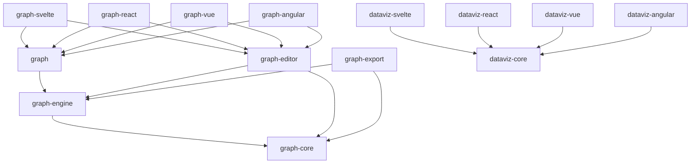

# Pré-analyse de consolidation — publication graph/dataviz

_Date : 18 septembre 2026 — lane DESIGN, aucune modification de runtime/manifeste._

## Verdict provisoire

La cible à 24 packages publiables est trop fragmentée pour le bénéfice mesuré. Elle comporte **19 packages graph** (dont quatre bindings), alors que le code rapatrié disponible est aujourd’hui un seul package `@sentropic/graph` de **20 fichiers / 327 075 octets de sources de production / 211 exports**. Les **13 packages graph nouveaux** ne correspondent donc pas à 13 unités de code, de consommateurs ou de cadence actuellement mesurables : ce sont des frontières de conception prévues pour M2+.

La cible recommandée pour arbitrage est **14 packages publiables** : **9 graph** (dont les 4 adapters) + les **5 dataviz existants**. Elle évite **10 publications/tags/validations 2FA** par vague complète par rapport à la cible à 24, sans fusionner les quatre adapters ni enfreindre D8.

Cette note est une pré-analyse de conducteur, **pas** une substitution aux deux avis indépendants explicitement demandés (Astra et Fable 5.1).

## Faits mesurés

| Élément | Mesure | Interprétation pour le découpage |
|---|---:|---|
| Inventaire de couverture | 1 820 capacités ; 3 547 couples package/export | La couverture reste à préserver indépendamment du nombre de tarballs. |
| `@sentropic/graph` rapatrié | 20 fichiers ; 327 075 B prod ; 211 exports | Le rendu WebGL/Canvas et les layouts historiques sont déjà cohésifs dans un seul artefact public. |
| Gros modules graph | renderer 58 507 B ; layout-gitflow 37 626 B ; webgl-boxes 36 533 B ; webgl-shapes 33 478 B ; webgl-edges 32 719 B | Il y a une vraie frontière **moteur vs façade de rendu**, mais pas de preuve de valeur à publier SVG, DOM et WebGL séparément. |
| `@sentropic/dataviz-core` rapatrié | 69 fichiers ; 339 525 B prod ; 495 exports | Cœur data/store/builders déjà cohérent et consommé par les wrappers ; ne pas le découper. |
| APIs dataviz | Svelte 779 exports (282 propres) ; React 776 (278) ; Vue 776 (278) ; Angular 510 (13) | Les cinq packages dataviz historiques doivent rester des façades publiées ; l’écart Angular est majoritairement du re-export. |
| Packages M2+ (scene, codecs, worker, etc.) | non implémentés dans le worktree M0 | Aucune taille réelle, adoption externe, cadence ou dépendant ne justifie encore une publication autonome. |
| Dépendants workspace observables dans le worktree M0 | aucun consommateur déclaré hors les deux packages rapatriés | Ne pas faire passer l’hypothèse d’un consommateur futur pour une raison de coût de release présente. |

Les octets ci-dessus excluent les tests. La source M0 disponible ne contient pas encore les quatre wrappers dataviz ; leurs comptages d’exports proviennent de l’inventaire vérifié, pas d’une taille locale inventée.

## Proposition de consolidation : 14 packages publiables

### Les neuf packages graph

| Package publié | Contenu consolidé | Pourquoi il reste séparé | Charge / cadence attendue |
|---|---|---|---|
| `@sentropic/graph-core` | model + profiles + processing + codecs | Contrats purs, importables Node/SSR ; les codecs restent en sous-chemins lazy. | Sémantique/version de schéma ; faible volume de releases mais blast radius élevé, donc une seule validation ciblée. |
| `@sentropic/graph-engine` | scene + routing + layout + worker + compiler | Un pipeline unique document/projection → géométrie, déjà fortement couplé dans le DAG initial. | Évolutions algorithmiques et protocole worker doivent être cohérentes ; les séparer créerait des bumps coordonnés. |
| `@sentropic/graph` | façade historique + render WebGL/Canvas + SVG + DOM | Nom public déjà existant ; les backends partagent scène, métriques, picking et tokens. Sous-chemins `./webgl`, `./canvas`, `./svg`, `./dom` pour le chargement. | Les correctifs de peinture peuvent sortir sans imposer un nouveau nom de package. |
| `@sentropic/graph-editor` | ancien `graph-canvas` : commandes, outils, history, interactions, annotations, viewport | Frontière fonctionnelle nette : risque UI/gestes, dépendance navigateur et maturité v2/v3 distinctes. | Cadence UX élevée ; ne doit pas faire bouger le noyau/render. |
| `@sentropic/graph-export` | export plan, raster, PDF/PPTX/print, Graphviz outputs | Peers optionnels PDF et contraintes runtime distinctes ; aucun adapter dataviz ne le dépend statiquement. | Releases d’encodeurs isolées, chargement lazy obligatoire. |
| `@sentropic/graph-svelte` | binding Svelte | Peer/lifecycle/SSR propres. | Release seulement avec API binding Svelte. |
| `@sentropic/graph-react` | binding React | Peer/lifecycle/SSR propres. | Release seulement avec API binding React. |
| `@sentropic/graph-vue` | binding Vue | Peer/lifecycle/SSR propres. | Release seulement avec API binding Vue. |
| `@sentropic/graph-angular` | binding Angular | Peer/lifecycle/SSR propres. | Release seulement avec API binding Angular. |

`graph-recipes` devient un **catalogue privé dans `apps/docs`**, versionné avec les démonstrations et non publié. Ses recettes restent exhaustives (186 vues/applications) mais n’imposent plus une validation de package. Les définitions exportables à des produits pourront être promues ultérieurement seulement lorsqu’un premier consommateur externe est prouvé.

### Les cinq packages dataviz (inchangés)

`@sentropic/dataviz-core`, `@sentropic/dataviz-svelte`, `@sentropic/dataviz-react`, `@sentropic/dataviz-vue`, `@sentropic/dataviz-angular` restent publiés. D8 demeure strict : aucun n’importe `graph-engine`, `graph-editor` ou `graph-export` à la racine. Les helpers d’export visuel sont soit conservés dans les adapters, soit appelés via une frontière optionnelle/lazy.

## Matrice de migration de la cible 24 → 14

| Cible initiale | Cible consolidée | Motif / impact migration |
|---|---|---|
| graph-model | graph-core | contrats purs ; sous-chemin `@sentropic/graph-core/model`. |
| graph-profiles | graph-core | co-versionnement nécessaire avec model ; sous-chemin `./profiles`. |
| graph-processing | graph-core | algorithmes topologiques purs ; sous-chemin `./processing`. |
| graph-codecs | graph-core | formats en sous-chemins lazy ; pas de tarball dédié sans consommateurs. |
| graph-scene | graph-engine | même pipeline que layout/routing/compiler. |
| graph-routing | graph-engine | contrat géométrique partagé avec scene/layout. |
| graph-layout | graph-engine | solveurs et options co-évoluent avec scene/routes. |
| graph-worker | graph-engine | protocole dépend directement du résultat de pipeline. |
| graph-compiler | graph-engine | orchestration du même pipeline. |
| graph | graph | API et nom existants préservés ; aucun changement d’import racine. |
| graph-svg | graph | sous-chemin `@sentropic/graph/svg`, pas une publication. |
| graph-dom | graph | sous-chemin `@sentropic/graph/dom`, pas une publication. |
| graph-canvas | graph-editor | renommage ratifié par amendement : `canvas` → `editor`. |
| graph-export | graph-export | conserve son isolation de peers/artefacts. |
| graph-recipes | `apps/docs` privé | catalogue et hosts ; zéro import public promis à M2. |
| graph-svelte/react/vue/angular | inchangés | quatre frontières framework/pairs indispensables. |
| dataviz-core et dataviz-{svelte,react,vue,angular} | inchangés | APIs publiques existantes et adoption framework distincte. |

## DAG de publication recommandé

Les adapters graph dépendent aussi de leur design-system et de themes ; ces arêtes préexistantes sont omises pour lisibilité. Aucun package dataviz n’a une arête vers la pile graph.

## Alternatives et seuils de promotion

| Option | Packages | Avantage | Défaut | Décision |
|---|---:|---|---|---|
| Cible initiale | 24 | frontières théoriques maximales | 18 nouveaux packages, 18 cycles de release à créer, nombreuses validations sans consommateur prouvé | rejetée comme défaut. |
| **Consolidée** | **14** | -42 % de packages ; isolation des trois frontières à vrai coût (core, engine, export) et des 4 frameworks | codecs partagent SemVer avec core ; nécessite des sous-chemins/sideEffects réels | recommandée. |
| Ultra-consolidée | 12 | deux validations de moins | fusionner editor/export au moteur mélange navigateur, peers PDF et cadence UX | non recommandée. |

Un sous-domaine ne redevient package autonome que si les quatre critères sont documentés : (1) deux consommateurs indépendants, (2) cadence incompatible pendant deux releases, (3) isolation de bundle démontrée impossible via sous-chemin, (4) blast radius réduit par une version indépendante. Une taille seule ne suffit pas.

## Invariants non négociables

1. D8 : charts et dashboards ne tirent jamais le moteur de graphe, l’éditeur ou l’export graph en dépendance transitive.
2. `@sentropic/graph` et les cinq noms `@sentropic/dataviz-*` restent stables.
3. Aucun runtime ELK/Graphviz/JointJS/diagram-js implicite ; les compatibilités restent des capacités qualifiées.
4. La scène v1 SVG demeure CSP-safe, sans `style` inline ; l’éditeur interactif reste explicitement gaté.
5. Le noyau sémantique reste le pivot `graph-model` **à l’intérieur de `graph-core`**, sans créer un second métamodèle.
6. Les sous-chemins doivent être protégés par `exports` et `sideEffects` : importer model/CSV/layout Node ne doit charger ni DOM, ni renderer, ni PDF, ni framework.
