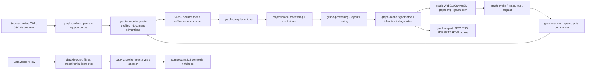

# SPEC_EVOL_GRAPH_DATAVIZ_PACKAGES — architecture et nommage D5

> **Statut remplacé pour la publication.** Cette version conserve l’étude exhaustive de couverture et les frontières fonctionnelles, mais sa cible à 24 packages publiables est remplacée par la consolidation à 14 packages documentée dans [la pré-analyse de consolidation](../docs/graph-dataviz-consolidation-preanalysis.md), ratifiée par le propriétaire le 18 septembre 2026. Les allocations de capacités restent la source de vérité ; la matrice de migration 24 → 14 définit désormais les frontières de publication. M2 reste suspendu jusqu’aux avis indépendants Astra et Fable 5.1 demandés par le propriétaire.

Révision : étude de complétude du 15–16 septembre 2026, statut de publication mis à jour le 18 septembre. Lane DESIGN ; conducteur **design-system** ; revue fable prévue avant réalisation. Cette spec applique les décisions ratifiées. Elle définit la cible fonctionnelle ; elle ne prétend pas que les packages nouveaux sont créés, publiés ou qualifiés.

## 1. Résultat et décisions appliquées

**24 packages graph/dataviz, dont 18 nouveaux et 6 noms existants préservés**, avec six dépendances DS déjà nommées. Le découpage résulte de la nature des contrats, des consommateurs autonomes et des frontières de chargement. Ni ELK ni Graphviz ni JointJS n’apparaissent dans un nom de package Sentropic : ce sont des références de capacités. Les familles d’algorithmes et les recettes deviennent des sous-chemins ou des données, pas une multiplication de packages par fournisseur ou démo.

Le [catalogue fonctionnel](../docs/graph-dataviz-functional-coverage.md) énumère les capacités et leurs sources. Le [JSON compagnon](../docs/graph-dataviz-functional-coverage.json) relie **chaque entrée** au propriétaire et aux contributeurs. [L’allocation inverse](../docs/graph-dataviz-study/package-coverage.md) énumère les clés exactes couvertes par chaque package ; elle fait partie de chaque fiche ci-dessous. Le [catalogue des modules](../docs/graph-dataviz-study/source-modules.md) et le mapping des 3547 exports garantissent le maintien des noms publics.

| Décision ratifiée | Application concrète |
|---|---|
| D1=A | `graph-model` typé ; `graph-profiles` versionnés, migrations et diagnostics explicites. |
| D2=C | Versions indépendantes pour chaque package ; tags `<package-sans-scope>@<semver>`. Aucun nouveau `v*` global. |
| D3=A | Un `graph-compiler` agnostique ; `graph-svelte`, `graph-react`, `graph-vue`, `graph-angular` qualifiés séparément. Les builders dataviz restent partagés dans core. |
| D4=C′ | `dataviz-angular` garde son nom ; seam expérimental sur une ligne de versions distincte, distribué sous `next`. La qualification BI se mesure sur les composants BI, pas sur la tranche diagramme M3. |
| D5=B | Étude exhaustive, noms justifiés et rattachement complet dans cette spec ; aucune décision déjà ratifiée remise en question. |
| D6=C | Versions/pins décidés par matrice de compatibilité vérifiée ; aucun alignement artificiel au numéro du DS ou du core. |
| D7=A | Réutilisation Sentropic puis réimplémentation/adaptateur autonome ; nouveau runtime tiers seulement après décision owner explicite. |

Le JSON de ratification abrège D4 en C ; l’instruction owner et le mandat précisent C′ et prévalent. Les anciens inventaires contiennent deux faits corrigés par le mandat : DS Angular est publié (correction F1), et DashboardGrid fait partie des versions dataviz indiquées par F2. Le tarball local reste un raccord source à remplacer, pas la preuve que le DS n’est pas publié. L’état npm courant n’est pas extrapolé.

## 2. Méthode de découpage et vocabulaire

Un package est justifié lorsque son contrat peut être consommé seul, que son environnement ou sa politique de dépendances diffère, ou que sa qualification exige un cycle propre. Une option ELK, un moteur du même registre, un format dans une famille d’encodeurs et une démo composée ne suffisent pas à créer un package.

| Terme dans le nom | Responsabilité précise | Frontière |
|---|---|---|
| `model` | Identité sémantique, document, occurrences, commandes et ports | Sans géométrie, framework ou persistance imposée |
| `profiles` | Vocabulaires et contraintes métier versionnés | Un schéma de profil ne suit pas automatiquement le SemVer du package |
| `codecs` | Sources et modèles interopérables, AST/CST, rapports de conversion | Aucun encodeur de capture d’écran ni service réseau |
| `processing` | Topologie, sous-graphes, chemins et projections | Dijkstra ne produit pas une route graphique |
| `layout` | Placement, phases, contraintes, registres et options | Résultat géométrique ; familles partageant les contrats |
| `routing` | Trajectoires visuelles, ports et obstacles | Utilisable sans déplacer les nœuds ; dépendance vers le bas depuis layout |
| `scene` | Géométrie, caméra, buffers, picking et métriques | Une scène n’est pas le document sémantique |
| `worker` | Protocole d’exécution hors thread et snapshots | Le transport ne devient pas un solveur |
| `compiler` | Transformation partagée document/vue/profil→scène | Les quatre frameworks n’en possèdent pas une copie |
| `svg`, `dom` | Backends avec environnements et coûts spécifiques | WebGL/Canvas2D restent dans `graph` existant |
| `canvas` | Session et contrôleur d’édition | Ce nom ne force pas le backend Canvas2D |
| `export` | Production d’artefacts et fidélité de sortie | JSON métier délégué aux codecs ; état BI conservé dans dataviz |
| `recipes` | Compositions et scénarios d’applications | Pas un autre moteur UI, pas une bibliothèque par démo |
| suffixe framework | Lifecycle, réactivité, DOM et primitives DS du framework | Aucun état BI ou calcul métier recopié |

Le split `graph-processing` / `graph-layout` est retenu malgré un package supplémentaire : des clients de chemins/projections n’ont besoin ni de solveur ni de géométrie. `graph-routing` reste autonome pour rerouter après déplacement sans recomposer tout un layout. Les profils et codecs partagent des sous-chemins de domaine ; aucun package BPMN/ArchiMate/UML séparé sans besoin de release démontré.

Le package `graph` conserve ses API WebGL/Canvas2D et son entrée `.`. Les extractions se font derrière cette façade. Les cinq packages dataviz conservent tous leurs exports, y compris les réexports de core : ceux-ci ne deviennent pas des copies. Le DS général dépend au plus des calculs purs extraits ; les nouveaux adaptateurs graph consomment le DS et détiennent la composition canvas.

## 3. Flux fonctionnel et modèle formel

Ce diagramme décrit les échanges de données, donc la boucle d’édition. Le **graphe de dépendances de packages** au §6 est, lui, acyclique.

Cinq objets restent distincts : document sémantique ; vues/occurrences ; projection de processing ; géométrie/scène ; sources AST/CST. Les refs identifient les relations aussi bien que les entités, avec références relation→relation et occurrences de liens. Les éléments inconnus des codecs restent en extensions typées ou déclenchent un rapport ; ils ne disparaissent pas silencieusement. Une vue peut montrer plusieurs occurrences d’une même entité et une relation peut traverser des groupes/vues selon le profil.

Les commandes contiennent une cible (entité, relation, occurrence ou vue), une révision attendue et un payload typé. Humain et agent passent par la même validation. Le contrôleur produit un aperçu réversible, puis une transaction atomique, puis une requête de persistance par port. Undo/redo applique l’inverse ou un changement validé ; l’état inter-vues BI reste dans dataviz-core.

Le worker reçoit `protocolVersion`, `documentRevision`, `viewRevision`, `projectionHash`, `jobId`, `generation`, seed et options normalisées. Son résultat contient les mêmes corrélations et une géométrie riche. Une édition invalide l’ancien résultat ; une annulation suivie d’un nouveau job ne réactive jamais l’ancien. Aucun accès global `Worker`, `document` ou `window` à l’import des noyaux. Les mesures texte/images sont injectées et réutilisées au layout, au rendu et à l’export.

## 4. Aire fonctionnelle → packages

Les tableaux détaillés du catalogue ont une destination pour chaque ligne. Ce tableau donne les regroupements ; l’annexe inverse conserve toutes les clés, sans sélection de quelques exemples.

| Aire fonctionnelle | Package(s) cible(s) |
|---|---|
| Contrats / modèle / commandes | graph-model, graph-profiles |
| Pivots et AST/CST / JSON sémantique / XML / DSL | graph-codecs (+ graph-profiles) |
| Parcours / composantes / chemins / projections | graph-processing |
| 21 références ELK, 60 groupes, 286 fiches, 10 moteurs Graphviz | graph-layout ; libavoid/contraintes de routage → graph-routing |
| 177 attributs Graphviz | graph-codecs parse ; behavior owner par attribut : layout/routing/scene/svg/export |
| Graphify force / hierarchy / registry / grilles / scènes | graph-layout, graph-worker, graph-compiler, graph-scene ; sélection produit reste graphify |
| Rendu GPU / Canvas2D de compatibilité | graph |
| SVG / HTML-DOM / composition hybride | graph-svg, graph-dom ; géométrie commune graph-scene |
| 65 sorties Graphviz + PDF PNG SVG JPEG PPTX HTML print | graph-export ; variantes et surfaces natives explicitement qualifiées |
| GraphML / DOT / mxGraph / XMI / Mermaid / PlantUML / BPMN / ArchiMate / VSDX / Canvas JSON / Cypher / GoogleSQL | graph-codecs ; projection métier et push réseau restent produits |
| CSV / état et JSON dashboard / builders / crossfilter | dataviz-core ; wrappers dataviz-&lt;framework&gt; conservés |
| Canvas / outils / édition / sélection / annotations | graph-canvas ; graph-model validation ; graph-scene picking |
| Compilation commune + DS quatre frameworks | graph-compiler + graph-svelte/react/vue/angular |
| 186 vues JointJS et 61 features | graph-recipes + propriétaire de chaque feature + quatre graph adapters + hosts docs |
| Charts et helpers DS actuels | design-system-svelte/react/vue/angular ; calculs purs → layout/scene par tranche compatible |
| Thèmes / tokens | design-system-themes, design-system-tokens |

## 5. Fiche de chaque package

Les dépendances ci-dessous sont la **cible après extraction**, pas une modification des manifests pendant cette lane. M1 rapatrie l’existant sans refonte. Les sous-chemins indiqués sont des contrats à créer et qualifier, pas des exports déjà publiés. Pour chaque fiche, la section correspondante de [package-coverage.md](../docs/graph-dataviz-study/package-coverage.md) donne la liste exacte des entrées possédées et contributrices ; les fichiers source et noms d’exports sont dans source-modules.md.

### 5.1. `@sentropic/graph-model`

Document sémantique typé, entités et relations de première classe, vues, occurrences, références, révisions ; projections de calcul ; AST/CST et provenance par références ; commandes/transactions et validation commune humain-agent ; ports persistence/ressources/présence.

- **Nom :** model désigne les identités et invariants sémantiques ; ni géométrie ni widgets.
- **Couche / environnement :** contrats & noyau ; TypeScript agnostique, import sans DOM.
- **Surface prévue :** `document`, `views`, `references`, `commands`, `projection`, `source`, `ports`.
- **Entrées exactes :** [allocation @sentropic/graph-model](../docs/graph-dataviz-study/package-coverage.md#sentropicgraph-model) ; 8 entrées principales, 62 contributions. Contrats et canvas (4), JointJS features (4).
- **Dépendances internes :** aucune.
- **Dépendances externes / peers :** aucun nouveau runtime tiers ; manifests existants conservés en M1, versions effectives par matrice D6
- **Réemploi :** Contrats graph/types.ts et dataviz/model.ts comme entrées de compatibilité ; ne pas assimiler Row ou HighLevelGraphInput au nouveau Document.
- **Version et tag :** SemVer indépendant ; tag `graph-model@<version>` ; matrice de compatibilité D6 ; aucun tag v* global.
- **Qualification :** Références pendantes, relation→relation, occurrences multiples, validation profil, transactions et migrations testées sans DOM.

### 5.2. `@sentropic/graph-profiles`

Profils versionnés BPMN, ArchiMate, UML/SysML, ER, processus, circuits et contraintes métier ; palettes et règles sémantiques déclaratives.

- **Nom :** profiles applique D1 : extensions typées et versions de schéma indépendantes du SemVer du package.
- **Couche / environnement :** domaines ; TypeScript agnostique, import sans DOM.
- **Surface prévue :** `bpmn`, `archimate`, `uml`, `sysml`, `entity-relationship`, `process`, `circuit`.
- **Entrées exactes :** [allocation @sentropic/graph-profiles](../docs/graph-dataviz-study/package-coverage.md#sentropicgraph-profiles) ; 9 entrées principales, 88 contributions. Contrats et canvas (1), Domaines et codecs (7), JointJS features (1).
- **Dépendances internes :** `@sentropic/graph-model`.
- **Dépendances externes / peers :** aucun nouveau runtime tiers ; manifests existants conservés en M1, versions effectives par matrice D6
- **Réemploi :** Types/relations graphify génériques réutilisables, producteurs de connaissance laissés au produit.
- **Version et tag :** SemVer indépendant ; tag `graph-profiles@<version>` ; matrice de compatibilité D6 ; aucun tag v* global.
- **Qualification :** Fixtures positives/négatives par version de profil ; migrations ; couverture métier distincte des glyphes.

### 5.3. `@sentropic/graph-scene`

Scène commune, routes et labels calculés, ports, glyphes, buffers, caméra, transformations, spatial index/picking, métriques et transitions géométriques.

- **Nom :** scene représente la géométrie prête à peindre, distincte du modèle sémantique.
- **Couche / environnement :** scène & géométrie ; TypeScript agnostique, import sans DOM.
- **Surface prévue :** `scene`, `geometry`, `camera`, `picking`, `buffers`, `text`, `animation`.
- **Entrées exactes :** [allocation @sentropic/graph-scene](../docs/graph-dataviz-study/package-coverage.md#sentropicgraph-scene) ; 81 entrées principales, 478 contributions. Graphviz attributs (55), Sentropic ponts et producteurs (1), Sentropic modules (8), Contrats et canvas (2), Rendu capacités (2), Exports Sentropic / mandat (1), JointJS features (11), Processing complémentaire (1).
- **Dépendances internes :** `@sentropic/graph-model`.
- **Dépendances externes / peers :** aucun nouveau runtime tiers ; manifests existants conservés en M1, versions effectives par matrice D6
- **Réemploi :** graph/{buffers,positions,styles,shape-geometry,render-geometry,edge-geometry,mat4,gitflow-labels}.ts ; helpers DS.
- **Version et tag :** SemVer indépendant ; tag `graph-scene@<version>` ; matrice de compatibilité D6 ; aucun tag v* global.
- **Qualification :** Même identité et géométrie pour SVG/WebGL/DOM/Canvas2D ; picking indépendant backend, tolérances chiffrées ; métriques injectables.

### 5.4. `@sentropic/graph-codecs`

Parse/serialize modèles et sources : JSON document, Mermaid, PlantUML/UML, BPMN XML+DI, ArchiMate Exchange, draw.io/mxGraph, Sparx EA XMI par dialecte, Visio VSDX, DOT/xdot, GraphML, Obsidian Canvas, Cypher/GoogleSQL et XML/ZIP sans réseau implicite. Rapports de conversion et conservation AST/CST/extensions.

- **Nom :** codecs nomme les conversions bidirectionnelles qualifiées ; exporter une image appartient à graph-export.
- **Couche / environnement :** domaines & codecs ; TypeScript agnostique, import sans DOM.
- **Surface prévue :** `json`, `mermaid`, `plantuml`, `bpmn`, `archimate`, `drawio`, `xmi`, `visio`, `dot`, `graphml`, `obsidian`, `database-scripts`, `xml`, `source-map`.
- **Entrées exactes :** [allocation @sentropic/graph-codecs](../docs/graph-dataviz-study/package-coverage.md#sentropicgraph-codecs) ; 21 entrées principales, 209 contributions. Domaines et codecs (10), Exports Sentropic / mandat (8), JointJS features (3).
- **Dépendances internes :** `@sentropic/graph-model`, `@sentropic/graph-profiles`, `@sentropic/graph-scene`.
- **Dépendances externes / peers :** aucun nouveau runtime tiers ; manifests existants conservés en M1, versions effectives par matrice D6
- **Réemploi :** Sérialisations Sentropic existantes comme fixtures/compat ; aucune lib de parser tierce implicitement transportée.
- **Version et tag :** SemVer indépendant ; tag `graph-codecs@<version>` ; matrice de compatibilité D6 ; aucun tag v* global.
- **Qualification :** Sous-ensembles documentés par dialecte/version, pertes localisées ; cycle parse/serialize et fixtures hostiles ; aucun round-trip universel promis.

### 5.5. `@sentropic/graph-processing`

Parcours, composantes, tri topologique, chemins (Dijkstra), sous-graphes, agrégation et projections de graphe ; diagnostics structurels pour les layouts.

- **Nom :** processing traite la topologie et les données, sans promettre des coordonnées ; sépare les chemins analytiques du routage visuel.
- **Couche / environnement :** processing ; TypeScript agnostique, import sans DOM.
- **Surface prévue :** `traversal`, `components`, `paths`, `projection`, `constraints`.
- **Entrées exactes :** [allocation @sentropic/graph-processing](../docs/graph-dataviz-study/package-coverage.md#sentropicgraph-processing) ; 4 entrées principales, 2 contributions. Sentropic ponts et producteurs (1), Contrats et canvas (1), Processing complémentaire (2).
- **Dépendances internes :** `@sentropic/graph-model`.
- **Dépendances externes / peers :** aucun nouveau runtime tiers ; manifests existants conservés en M1, versions effectives par matrice D6
- **Réemploi :** Extraire uniquement helpers génériques Sentropic ; graphology/Louvain de retrieval restent dans graphify.
- **Version et tag :** SemVer indépendant ; tag `graph-processing@<version>` ; matrice de compatibilité D6 ; aucun tag v* global.
- **Qualification :** Résultats topologiques et cas cycles/multigraphes vérifiés ; provenance conservée ; 0 dependency de renderer.

### 5.6. `@sentropic/graph-routing`

Chemins visuels orthogonaux, octilinéaires, segments, courbes, évitement obstacles, ports/ancres, buses, hyperarêtes, link-to-link, self-loops, labels.

- **Nom :** routing distingue les trajectoires dessinées des chemins analytiques et du placement de nœuds.
- **Couche / environnement :** processing / routage ; TypeScript agnostique, import sans DOM.
- **Surface prévue :** `orthogonal`, `octilinear`, `curves`, `obstacles`, `ports`, `labels`, `bundles`.
- **Entrées exactes :** [allocation @sentropic/graph-routing](../docs/graph-dataviz-study/package-coverage.md#sentropicgraph-routing) ; 48 entrées principales, 332 contributions. ELK algorithmes (1), ELK options (19), Graphviz attributs (19), Contrats et canvas (1), JointJS features (7), Processing complémentaire (1).
- **Dépendances internes :** `@sentropic/graph-model`, `@sentropic/graph-scene`.
- **Dépendances externes / peers :** aucun nouveau runtime tiers ; manifests existants conservés en M1, versions effectives par matrice D6
- **Réemploi :** graph/{render-geometry,edge-geometry}.ts, DS arêtes SVG ; comparaison libavoid/Graphviz sans dépendance.
- **Version et tag :** SemVer indépendant ; tag `graph-routing@<version>` ; matrice de compatibilité D6 ; aucun tag v* global.
- **Qualification :** Obstacles, clearance, extrémités, ports, labels et impossibles diagnostiqués ; géométrie commune aux backends.

### 5.7. `@sentropic/graph-layout`

Registre et phases de placement, les 21 références ELK et 10 entrées Graphviz, leurs groupes/options, layouts graphify et DS ; layered, arbres, radial/circulaire, force/stress, grilles, packing/compaction/overlap ; seed/incrémental/contraintes.

- **Nom :** layout a un contrat géométrique unique ; familles et variantes en sous-chemins, aucun package par algorithme fournisseur.
- **Couche / environnement :** processing / placement ; TypeScript agnostique, import sans DOM.
- **Surface prévue :** `registry`, `layered`, `tree`, `radial`, `force`, `stress`, `grid`, `packing`, `compaction`, `fixed`, `random`, `domain`.
- **Entrées exactes :** [allocation @sentropic/graph-layout](../docs/graph-dataviz-study/package-coverage.md#sentropicgraph-layout) ; 457 entrées principales, 56 contributions. ELK algorithmes (20), ELK groupes options (60), ELK options (267), Graphviz moteurs (10), Graphviz attributs (57), Sentropic moteurs (30), Sentropic modules (6), Contrats et canvas (1), JointJS features (1), Processing complémentaire (5).
- **Dépendances internes :** `@sentropic/graph-model`, `@sentropic/graph-processing`, `@sentropic/graph-scene`, `@sentropic/graph-routing`.
- **Dépendances externes / peers :** aucun nouveau runtime tiers ; manifests existants conservés en M1, versions effectives par matrice D6
- **Réemploi :** graph/layout*.ts ; graphify/src/{graph-layout,hierarchy-layout}.ts ; simulations DS ForceGraph et layouts charts.
- **Version et tag :** SemVer indépendant ; tag `graph-layout@<version>` ; matrice de compatibilité D6 ; aucun tag v* global.
- **Qualification :** Chaque ID/options reference possède fixture et statut ; résultat positions/rects/ports/routes/labels/diagnostics ; déterminisme ≠ stabilité incrémentale ; compat PositionFrame explicite.

### 5.8. `@sentropic/graph-worker`

Protocole de jobs sur snapshots révisionnés, transfert buffers, progrès, annulation, timeout, choix de moteur, rejet résultats périmés et fallback synchrone.

- **Nom :** worker nomme le mode d’exécution ; ne présente pas le transport comme un nouvel algorithme.
- **Couche / environnement :** moteurs / exécution ; TypeScript agnostique, import sans DOM.
- **Surface prévue :** `protocol`, `browser`, `synchronous`.
- **Entrées exactes :** [allocation @sentropic/graph-worker](../docs/graph-dataviz-study/package-coverage.md#sentropicgraph-worker) ; 3 entrées principales, 0 contributions. Sentropic moteurs (2), Contrats et canvas (1).
- **Dépendances internes :** `@sentropic/graph-model`, `@sentropic/graph-scene`, `@sentropic/graph-layout`.
- **Dépendances externes / peers :** aucun nouveau runtime tiers ; manifests existants conservés en M1, versions effectives par matrice D6
- **Réemploi :** graphify/studio/src/lib/{layoutWorker,forceLayoutClient}.js ; supprimer alias Vite privé après bascule.
- **Version et tag :** SemVer indépendant ; tag `graph-worker@<version>` ; matrice de compatibilité D6 ; aucun tag v* global.
- **Qualification :** Révision document+vue+projection, jobId/generation ; après édition, ancien résultat refusé ; byte-equivalence sync/worker ; aucun global Worker à import.

### 5.9. `@sentropic/graph-compiler`

Compilateur unique document/profil/vue → projection, plan de processing et scène/contrats interaction ; métriques texte/image et moteurs injectables ; sortie sérialisable identique pour les quatre frameworks.

- **Nom :** compiler décrit la transformation partagée ; views appartient déjà au modèle. D3 ne signifie ni quatre compilateurs, ni un parseur commun à tous dialectes.
- **Couche / environnement :** compilation ; TypeScript agnostique, import sans DOM.
- **Surface prévue :** `compile`, `projection`, `diagnostics`.
- **Entrées exactes :** [allocation @sentropic/graph-compiler](../docs/graph-dataviz-study/package-coverage.md#sentropicgraph-compiler) ; 7 entrées principales, 191 contributions. Sentropic moteurs (1), Sentropic ponts et producteurs (4), Contrats et canvas (2).
- **Dépendances internes :** `@sentropic/graph-model`, `@sentropic/graph-profiles`, `@sentropic/graph-processing`, `@sentropic/graph-layout`, `@sentropic/graph-scene`.
- **Dépendances externes / peers :** aucun nouveau runtime tiers ; manifests existants conservés en M1, versions effectives par matrice D6
- **Réemploi :** Séparer le raccord générique des scene-layout/studio-render-buffers/graphRendererPayload ; producteur graph.json reste produit.
- **Version et tag :** SemVer indépendant ; tag `graph-compiler@<version>` ; matrice de compatibilité D6 ; aucun tag v* global.
- **Qualification :** Un corpus et un hash de scène partagé 4-fw ; aucune API DOM/framework ; diagnostics source→entity→occurrence ; aucune dépendance focus-render/Track.

### 5.10. `@sentropic/graph`

Renderer Sentropic WebGL2 et Canvas2D ; buffers et API historiques préservés, façade délégante vers scene/layout après extraction compatible.

- **Nom :** Nom publié @sentropic/graph préservé ; aucune nouvelle marque remplaçant la bibliothèque.
- **Couche / environnement :** moteurs / compatibilité publique ; Backend navigateur WebGL2/Canvas2D ; helpers purs ; import sans instanciation browser à qualifier.
- **Surface prévue :** `.`.
- **Entrées exactes :** [allocation @sentropic/graph](../docs/graph-dataviz-study/package-coverage.md#sentropicgraph) ; 10 entrées principales, 2 contributions. Sentropic ponts et producteurs (1), Sentropic modules (5), Rendu capacités (4).
- **Dépendances internes :** `@sentropic/graph-scene`, `@sentropic/graph-layout`.
- **Dépendances externes / peers :** aucun nouveau runtime tiers ; manifests existants conservés en M1, versions effectives par matrice D6
- **Manifest source 0.2.0 :** dependencies aucune ; peers aucun. Cette combinaison est un constat source, pas une nouvelle matrice certifiée.
- **Réemploi :** Intégralité packages/graph (211 exports), tests, golden, bench, licence et provenance ; M1 intact avant extraction.
- **Version et tag :** SemVer indépendant ; tag `graph@<version>` ; matrice de compatibilité D6 ; aucun tag v* global.
- **Qualification :** ESM+CJS+types et 211 exports conservés ; goldens Canvas2D/WebGL ; canari WebGL et fallback restent visibles.

### 5.11. `@sentropic/graph-svg`

Peinture SVG de la scène, sérialisation vectorielle, DOM SVG interactif, marqueurs, texte, clip/mask/gradients, images ; support SSR sérialisé.

- **Nom :** svg désigne le backend, pas une variante du document ou un codec métier.
- **Couche / environnement :** moteurs de rendu ; TypeScript agnostique, import sans DOM.
- **Surface prévue :** `serialize`, `dom`.
- **Entrées exactes :** [allocation @sentropic/graph-svg](../docs/graph-dataviz-study/package-coverage.md#sentropicgraph-svg) ; 25 entrées principales, 188 contributions. Graphviz attributs (22), Rendu capacités (3).
- **Dépendances internes :** `@sentropic/graph-scene`.
- **Dépendances externes / peers :** aucun nouveau runtime tiers ; manifests existants conservés en M1, versions effectives par matrice D6
- **Réemploi :** shapeSvgPath et render-geometry graph ; primitives SVG DS, adaptation sans recopier les composants.
- **Version et tag :** SemVer indépendant ; tag `graph-svg@<version>` ; matrice de compatibilité D6 ; aucun tag v* global.
- **Qualification :** Parité géométrique avec graph ; styles/tokens résolus, font metrics identiques, lien occurrence→element et snapshot SVG.

### 5.12. `@sentropic/graph-dom`

Nœuds HTML-DOM, formulaires, texte/IME, measurements ; composition hybride avec layer arêtes SVG ou WebGL fourni par port, coords/caméra/focus synchronisés.

- **Nom :** dom dit explicitement que le backend travaille sur éléments HTML ; HTML ne fournit pas implicitement le routage des arêtes.
- **Couche / environnement :** moteurs de rendu ; DOM navigateur ; contrat importable sans document.
- **Surface prévue :** `nodes`, `measure`, `hybrid`.
- **Entrées exactes :** [allocation @sentropic/graph-dom](../docs/graph-dataviz-study/package-coverage.md#sentropicgraph-dom) ; 5 entrées principales, 8 contributions. Rendu capacités (4), JointJS features (1).
- **Dépendances internes :** `@sentropic/graph-scene`.
- **Dépendances externes / peers :** aucun nouveau runtime tiers ; manifests existants conservés en M1, versions effectives par matrice D6
- **Réemploi :** Contrôles DS existants et GraphCanvas Svelte ; rendu HTML générique nouveau à qualifier.
- **Version et tag :** SemVer indépendant ; tag `graph-dom@<version>` ; matrice de compatibilité D6 ; aucun tag v* global.
- **Qualification :** resize/zoom/scroll, arêtes cross-layer, IME/focus/clavier et SSR placeholder, CSP qualifiée ; aucun framework intégré.

### 5.13. `@sentropic/graph-canvas`

Contrôleur headless sélection, déplacements/redim/rotation, ports/liens, snap/guides/groupes, clipboard, undo-redo, annotations/cerclage, viewport, outils, modes ; commandes validées et ports de persistence/présence.

- **Nom :** canvas signifie surface de travail éditable multi-backend ; ne force ni Canvas2D ni état BI.
- **Couche / environnement :** interaction & canvas ; TypeScript agnostique, import sans DOM.
- **Surface prévue :** `controller`, `commands`, `tools`, `clipboard`, `history`, `annotations`, `viewport`.
- **Entrées exactes :** [allocation @sentropic/graph-canvas](../docs/graph-dataviz-study/package-coverage.md#sentropicgraph-canvas) ; 32 entrées principales, 193 contributions. Sentropic ponts et producteurs (1), Contrats et canvas (2), Rendu capacités (3), JointJS features (26).
- **Dépendances internes :** `@sentropic/graph-model`, `@sentropic/graph-scene`, `@sentropic/graph-processing`, `@sentropic/graph-routing`.
- **Dépendances externes / peers :** aucun nouveau runtime tiers ; manifests existants conservés en M1, versions effectives par matrice D6
- **Réemploi :** Gestes GraphCanvas, sélection renderer à extraire vers scene, DiagramAnnotator (ellipse/rect/PNG) ; UI générique via DS.
- **Version et tag :** SemVer indépendant ; tag `graph-canvas@<version>` ; matrice de compatibilité D6 ; aucun tag v* global.
- **Qualification :** preview/transaction/persistence distincts ; humains/agents mêmes validations ; undo atomique et conflicts révision ; aucun verrou déduit h2a/Track.

### 5.14. `@sentropic/graph-export`

Plan d’export scène, ressources/fonts, SVG/raster/PDF/PPTX/HTML/print, sorties Graphviz et surfaces terminal/native explicitement typées ; page/tile/scale et rapport de fidélité. JSON document délégué au codec ; données CSV à dataviz-core.

- **Nom :** export nomme les artefacts livrables distincts de la conversion sémantique ; sous-chemins évitent un package par extension.
- **Couche / environnement :** artefacts / exports ; Plan pur ; /raster,/print browser ; encodeurs isolés/lazy.
- **Surface prévue :** `plan`, `svg`, `raster`, `pdf`, `pptx`, `html`, `print`, `graphviz`, `terminal`, `native-surfaces`.
- **Entrées exactes :** [allocation @sentropic/graph-export](../docs/graph-dataviz-study/package-coverage.md#sentropicgraph-export) ; 100 entrées principales, 14 contributions. Graphviz attributs (24), Graphviz sorties (65), Exports Sentropic / mandat (7), JointJS features (4).
- **Dépendances internes :** `@sentropic/graph-model`, `@sentropic/graph-scene`, `@sentropic/graph-svg`, `@sentropic/graph-codecs`.
- **Dépendances externes / peers :** jspdf ^4.2.1 et svg2pdf.js ^2.7.0 : continuité des imports PDF dataviz existants ; isoler sous /pdf, ne pas importer depuis la racine. Versions finales pins D6 à qualifier. Aucune autre dependency nouvelle autorisée.
- **Réemploi :** dataviz-*/lib/chart-export.ts et DiagramAnnotator.toPNG ; maintenir les façades historiques.
- **Version et tag :** SemVer indépendant ; tag `graph-export@<version>` ; matrice de compatibilité D6 ; aucun tag v* global.
- **Qualification :** SVG/PNG/PDF/print régressions ; PPTX slides/médias/éditabilité explicites ; aucune sortie silencieusement substituée ; pixels vs objets vs sémantique tracés.

### 5.15. `@sentropic/graph-recipes`

186 recettes nommées par slug officiel JointJS, plus composition applications Sentropic ; documents/profils/configuration/commandes et scénarios de démonstration. Hosts docs 4-fw privés pour rendre chaque recette via API publiques.

- **Nom :** recipes regroupe des compositions démontrables ; pas 186 packages ni un autre moteur UI.
- **Couche / environnement :** applications réutilisables ; TypeScript agnostique, import sans DOM.
- **Surface prévue :** `catalog`, `workflow`, `modeling`, `hierarchy`, `planning`, `simulation`, `interaction`, `rendering`, `integration`, `export`.
- **Entrées exactes :** [allocation @sentropic/graph-recipes](../docs/graph-dataviz-study/package-coverage.md#sentropicgraph-recipes) ; 189 entrées principales, 9 contributions. Contrats et canvas (1), JointJS features (2), JointJS vues et applications (186).
- **Dépendances internes :** `@sentropic/graph-model`, `@sentropic/graph-profiles`.
- **Dépendances externes / peers :** aucun nouveau runtime tiers ; manifests existants conservés en M1, versions effectives par matrice D6
- **Réemploi :** Graphify studio et demos dataviz/DS comme sources de scénarios ; toute intégration vendor remplacée par port documenté.
- **Version et tag :** SemVer indépendant ; tag `graph-recipes@<version>` ; matrice de compatibilité D6 ; aucun tag v* global.
- **Qualification :** Chaque recette dispose de needs/features/capability refs et scénario rendu dans chacun des 4 hosts ; présence dans catalogue ≠ application implémentée.

### 5.16. `@sentropic/graph-svelte`

Binding svelte de graph-compiler/canvas et backends : GraphCanvas, palette, inspector, toolbar, minimap, formulaires HTML, contexte et a11y ; consumes controlled DS primitives.

- **Nom :** Suffixe svelte nomme le framework ; modèle cohérent avec dataviz-* ; aucune logique de compilation dupliquée.
- **Couche / environnement :** adaptateurs DS ; Adapter svelte ; framework peer, SSR qualifié.
- **Surface prévue :** `canvas`, `tools`, `renderers`.
- **Entrées exactes :** [allocation @sentropic/graph-svelte](../docs/graph-dataviz-study/package-coverage.md#sentropicgraph-svelte) ; 2 entrées principales, 195 contributions. Sentropic ponts et producteurs (1), Adaptateurs 4-fw (1).
- **Dépendances internes :** `@sentropic/graph-model`, `@sentropic/graph-scene`, `@sentropic/graph-compiler`, `@sentropic/graph-canvas`, `@sentropic/graph-svg`, `@sentropic/graph-dom`, `@sentropic/design-system-svelte`, `@sentropic/design-system-themes`.
- **Dépendances externes / peers :** Peer svelte selon matrice compatible ; aucun JointJS/ELK/Graphviz/xyflow impliqué.
- **Peers framework cibles :** `svelte` ; versions selon matrice qualifiée D6.
- **Réemploi :** Svelte GraphCanvas et DiagramAnnotator comme comportement de référence ; React/Vue/Angular adaptés aux conventions DS.
- **Version et tag :** SemVer indépendant ; tag `graph-svelte@<version>` ; matrice de compatibilité D6 ; aucun tag v* global.
- **Qualification :** Même contrat et mêmes scènes/commandes, fixtures SSR/clavier/focus/IME/tokens/CSP par framework ; backend graph WebGL fourni explicitement au host.

### 5.17. `@sentropic/graph-react`

Binding react de graph-compiler/canvas et backends : GraphCanvas, palette, inspector, toolbar, minimap, formulaires HTML, contexte et a11y ; consumes controlled DS primitives.

- **Nom :** Suffixe react nomme le framework ; modèle cohérent avec dataviz-* ; aucune logique de compilation dupliquée.
- **Couche / environnement :** adaptateurs DS ; Adapter react ; framework peer, SSR qualifié.
- **Surface prévue :** `canvas`, `tools`, `renderers`.
- **Entrées exactes :** [allocation @sentropic/graph-react](../docs/graph-dataviz-study/package-coverage.md#sentropicgraph-react) ; 1 entrées principales, 195 contributions. Adaptateurs 4-fw (1).
- **Dépendances internes :** `@sentropic/graph-model`, `@sentropic/graph-scene`, `@sentropic/graph-compiler`, `@sentropic/graph-canvas`, `@sentropic/graph-svg`, `@sentropic/graph-dom`, `@sentropic/design-system-react`, `@sentropic/design-system-themes`.
- **Dépendances externes / peers :** Peer react selon matrice compatible ; aucun JointJS/ELK/Graphviz/xyflow impliqué.
- **Peers framework cibles :** `react`, `react-dom` ; versions selon matrice qualifiée D6.
- **Réemploi :** Svelte GraphCanvas et DiagramAnnotator comme comportement de référence ; React/Vue/Angular adaptés aux conventions DS.
- **Version et tag :** SemVer indépendant ; tag `graph-react@<version>` ; matrice de compatibilité D6 ; aucun tag v* global.
- **Qualification :** Même contrat et mêmes scènes/commandes, fixtures SSR/clavier/focus/IME/tokens/CSP par framework ; backend graph WebGL fourni explicitement au host.

### 5.18. `@sentropic/graph-vue`

Binding vue de graph-compiler/canvas et backends : GraphCanvas, palette, inspector, toolbar, minimap, formulaires HTML, contexte et a11y ; consumes controlled DS primitives.

- **Nom :** Suffixe vue nomme le framework ; modèle cohérent avec dataviz-* ; aucune logique de compilation dupliquée.
- **Couche / environnement :** adaptateurs DS ; Adapter vue ; framework peer, SSR qualifié.
- **Surface prévue :** `canvas`, `tools`, `renderers`.
- **Entrées exactes :** [allocation @sentropic/graph-vue](../docs/graph-dataviz-study/package-coverage.md#sentropicgraph-vue) ; 1 entrées principales, 195 contributions. Adaptateurs 4-fw (1).
- **Dépendances internes :** `@sentropic/graph-model`, `@sentropic/graph-scene`, `@sentropic/graph-compiler`, `@sentropic/graph-canvas`, `@sentropic/graph-svg`, `@sentropic/graph-dom`, `@sentropic/design-system-vue`, `@sentropic/design-system-themes`.
- **Dépendances externes / peers :** Peer vue selon matrice compatible ; aucun JointJS/ELK/Graphviz/xyflow impliqué.
- **Peers framework cibles :** `vue` ; versions selon matrice qualifiée D6.
- **Réemploi :** Svelte GraphCanvas et DiagramAnnotator comme comportement de référence ; React/Vue/Angular adaptés aux conventions DS.
- **Version et tag :** SemVer indépendant ; tag `graph-vue@<version>` ; matrice de compatibilité D6 ; aucun tag v* global.
- **Qualification :** Même contrat et mêmes scènes/commandes, fixtures SSR/clavier/focus/IME/tokens/CSP par framework ; backend graph WebGL fourni explicitement au host.

### 5.19. `@sentropic/graph-angular`

Binding angular de graph-compiler/canvas et backends : GraphCanvas, palette, inspector, toolbar, minimap, formulaires HTML, contexte et a11y ; consumes controlled DS primitives.

- **Nom :** Suffixe angular nomme le framework ; modèle cohérent avec dataviz-* ; aucune logique de compilation dupliquée.
- **Couche / environnement :** adaptateurs DS ; Adapter angular ; framework peer, SSR qualifié.
- **Surface prévue :** `canvas`, `tools`, `renderers`.
- **Entrées exactes :** [allocation @sentropic/graph-angular](../docs/graph-dataviz-study/package-coverage.md#sentropicgraph-angular) ; 1 entrées principales, 195 contributions. Adaptateurs 4-fw (1).
- **Dépendances internes :** `@sentropic/graph-model`, `@sentropic/graph-scene`, `@sentropic/graph-compiler`, `@sentropic/graph-canvas`, `@sentropic/graph-svg`, `@sentropic/graph-dom`, `@sentropic/design-system-angular`, `@sentropic/design-system-themes`.
- **Dépendances externes / peers :** Peer angular selon matrice compatible ; aucun JointJS/ELK/Graphviz/xyflow impliqué.
- **Peers framework cibles :** `@angular/core`, `@angular/common` ; versions selon matrice qualifiée D6.
- **Réemploi :** Svelte GraphCanvas et DiagramAnnotator comme comportement de référence ; React/Vue/Angular adaptés aux conventions DS.
- **Version et tag :** SemVer indépendant ; tag `graph-angular@<version>` ; matrice de compatibilité D6 ; aucun tag v* global.
- **Qualification :** Même contrat et mêmes scènes/commandes, fixtures SSR/clavier/focus/IME/tokens/CSP par framework ; backend graph WebGL fourni explicitement au host.

### 5.20. `@sentropic/dataviz-core`

Tous exports actuels : modèle tabulaire, store/filtres/crossfilter/drill/bookmarks/URL, agrégats/calculs/pivots, palettes/formats, builders charts, annotations et layout dashboard.

- **Nom :** Nom existant conservé ; cohésion état+data builders consommés par 4 adapters, aucune preuve justifiant leur éclatement immédiat.
- **Couche / environnement :** dataviz / état et builders ; TypeScript agnostique, import sans DOM.
- **Surface prévue :** `.`.
- **Entrées exactes :** [allocation @sentropic/dataviz-core](../docs/graph-dataviz-study/package-coverage.md#sentropicdataviz-core) ; 72 entrées principales, 5 contributions. Sentropic moteurs (1), Sentropic modules (69), Exports Sentropic / mandat (2).
- **Dépendances internes :** aucune.
- **Dépendances externes / peers :** aucun nouveau runtime tiers ; manifests existants conservés en M1, versions effectives par matrice D6
- **Manifest source 0.4.52 :** dependencies aucune ; peers aucun. Cette combinaison est un constat source, pas une nouvelle matrice certifiée.
- **Réemploi :** 495 exports / 68 modules hors barrel, zéro runtime ; rapatrier sans refonte. CSV pur partagé depuis helper wrappers par tranche compatible.
- **Version et tag :** SemVer indépendant ; tag `dataviz-core@<version>` ; matrice de compatibilité D6 ; aucun tag v* global.
- **Qualification :** État et sérialisation, cross-view, 495 exports ; builders ≠ solveurs de layout ; aucun import canvas, DS ou DOM.

### 5.21. `@sentropic/dataviz-svelte`

Store bridge svelte, tous wrappers charts/dashboard/filtres/actions/exports actuels ; controlled DS rendu, état core ; export visuel partagé sans modifier API.

- **Nom :** Nom existant conservé avec son framework ; sémantique dashboard distincte de graph-canvas.
- **Couche / environnement :** dataviz / adaptateurs ; Adapter svelte ; peer framework.
- **Surface prévue :** `.`.
- **Entrées exactes :** [allocation @sentropic/dataviz-svelte](../docs/graph-dataviz-study/package-coverage.md#sentropicdataviz-svelte) ; 124 entrées principales, 0 contributions. Sentropic modules (123), Adaptateurs 4-fw (1).
- **Dépendances internes :** `@sentropic/dataviz-core`, `@sentropic/design-system-svelte`, `@sentropic/design-system-themes`, `@sentropic/graph-export`.
- **Dépendances externes / peers :** aucun nouveau runtime tiers ; manifests existants conservés en M1, versions effectives par matrice D6
- **Peers framework cibles :** `svelte` ; versions selon matrice qualifiée D6.
- **Manifest source 0.4.52 :** dependencies `@sentropic/dataviz-core@0.4.52`, `@sentropic/design-system-svelte@0.34.62`, `@sentropic/design-system-themes@0.11.0`, `jspdf@^4.2.1`, `svg2pdf.js@^2.7.0` ; peers `svelte@^5`. Cette combinaison est un constat source, pas une nouvelle matrice certifiée.
- **Réemploi :** Tout packages/dataviz-svelte ; Angular inclut le seam signals, QueryBar et DateHistogramChart.
- **Version et tag :** SemVer indépendant ; tag `dataviz-svelte@<version>` ; matrice de compatibilité D6 ; aucun tag v* global.
- **Qualification :** Surface export source, lifecycle subscriptions, interactions WP20, tarballs/CSS/SSR ; parité mesurée par composant, pas par export transitif.

### 5.22. `@sentropic/dataviz-react`

Store bridge react, tous wrappers charts/dashboard/filtres/actions/exports actuels ; controlled DS rendu, état core ; export visuel partagé sans modifier API.

- **Nom :** Nom existant conservé avec son framework ; sémantique dashboard distincte de graph-canvas.
- **Couche / environnement :** dataviz / adaptateurs ; Adapter react ; peer framework.
- **Surface prévue :** `.`.
- **Entrées exactes :** [allocation @sentropic/dataviz-react](../docs/graph-dataviz-study/package-coverage.md#sentropicdataviz-react) ; 122 entrées principales, 0 contributions. Sentropic modules (121), Adaptateurs 4-fw (1).
- **Dépendances internes :** `@sentropic/dataviz-core`, `@sentropic/design-system-react`, `@sentropic/design-system-themes`, `@sentropic/graph-export`.
- **Dépendances externes / peers :** aucun nouveau runtime tiers ; manifests existants conservés en M1, versions effectives par matrice D6
- **Peers framework cibles :** `react`, `react-dom` ; versions selon matrice qualifiée D6.
- **Manifest source 0.4.52 :** dependencies `@sentropic/dataviz-core@0.4.52`, `@sentropic/design-system-react@0.36.49`, `@sentropic/design-system-themes@0.11.0`, `jspdf@^4.2.1`, `svg2pdf.js@^2.7.0` ; peers `react@^19`. Cette combinaison est un constat source, pas une nouvelle matrice certifiée.
- **Réemploi :** Tout packages/dataviz-react ; Angular inclut le seam signals, QueryBar et DateHistogramChart.
- **Version et tag :** SemVer indépendant ; tag `dataviz-react@<version>` ; matrice de compatibilité D6 ; aucun tag v* global.
- **Qualification :** Surface export source, lifecycle subscriptions, interactions WP20, tarballs/CSS/SSR ; parité mesurée par composant, pas par export transitif.

### 5.23. `@sentropic/dataviz-vue`

Store bridge vue, tous wrappers charts/dashboard/filtres/actions/exports actuels ; controlled DS rendu, état core ; export visuel partagé sans modifier API.

- **Nom :** Nom existant conservé avec son framework ; sémantique dashboard distincte de graph-canvas.
- **Couche / environnement :** dataviz / adaptateurs ; Adapter vue ; peer framework.
- **Surface prévue :** `.`.
- **Entrées exactes :** [allocation @sentropic/dataviz-vue](../docs/graph-dataviz-study/package-coverage.md#sentropicdataviz-vue) ; 121 entrées principales, 0 contributions. Sentropic modules (120), Adaptateurs 4-fw (1).
- **Dépendances internes :** `@sentropic/dataviz-core`, `@sentropic/design-system-vue`, `@sentropic/design-system-themes`, `@sentropic/graph-export`.
- **Dépendances externes / peers :** aucun nouveau runtime tiers ; manifests existants conservés en M1, versions effectives par matrice D6
- **Peers framework cibles :** `vue` ; versions selon matrice qualifiée D6.
- **Manifest source 0.4.52 :** dependencies `@sentropic/dataviz-core@0.4.52`, `@sentropic/design-system-themes@0.11.0`, `@sentropic/design-system-vue@0.36.49`, `jspdf@^4.2.1`, `svg2pdf.js@^2.7.0` ; peers `vue@^3`. Cette combinaison est un constat source, pas une nouvelle matrice certifiée.
- **Réemploi :** Tout packages/dataviz-vue ; Angular inclut le seam signals, QueryBar et DateHistogramChart.
- **Version et tag :** SemVer indépendant ; tag `dataviz-vue@<version>` ; matrice de compatibilité D6 ; aucun tag v* global.
- **Qualification :** Surface export source, lifecycle subscriptions, interactions WP20, tarballs/CSS/SSR ; parité mesurée par composant, pas par export transitif.

### 5.24. `@sentropic/dataviz-angular`

Store bridge angular, tous wrappers charts/dashboard/filtres/actions/exports actuels ; controlled DS rendu, état core ; export visuel partagé sans modifier API.

- **Nom :** Nom existant conservé avec son framework ; sémantique dashboard distincte de graph-canvas.
- **Couche / environnement :** dataviz / adaptateurs ; Adapter angular ; peer framework.
- **Surface prévue :** `.`.
- **Entrées exactes :** [allocation @sentropic/dataviz-angular](../docs/graph-dataviz-study/package-coverage.md#sentropicdataviz-angular) ; 4 entrées principales, 0 contributions. Sentropic modules (3), Adaptateurs 4-fw (1).
- **Dépendances internes :** `@sentropic/dataviz-core`, `@sentropic/design-system-angular`, `@sentropic/design-system-themes`, `@sentropic/graph-export`.
- **Dépendances externes / peers :** aucun nouveau runtime tiers ; manifests existants conservés en M1, versions effectives par matrice D6
- **Peers framework cibles :** `@angular/core`, `@angular/common` ; versions selon matrice qualifiée D6.
- **Manifest source 0.4.52 :** dependencies `@sentropic/dataviz-core@0.4.52`, `@sentropic/design-system-angular@file:../../vendor/sentropic-design-system-angular-0.36.51.tgz`, `@sentropic/design-system-themes@0.11.0` ; peers `@angular/core@^20.0.0 || ^21.0.0 || ^22.0.0`. Cette combinaison est un constat source, pas une nouvelle matrice certifiée.
- **Réemploi :** Tout packages/dataviz-angular ; Angular inclut le seam signals, QueryBar et DateHistogramChart.
- **Version et tag :** SemVer indépendant ; tag `dataviz-angular@<version>` ; matrice de compatibilité D6 ; aucun tag v* global.
- **Qualification :** Surface export source, lifecycle subscriptions, interactions WP20, tarballs/CSS/SSR ; parité mesurée par composant, pas par export transitif.

### 5.25. `@sentropic/design-system-svelte`

Tous composants présentationnels DS existants, dont charts/graph legends/dashboard ; tokens et API contrôlée. Aucun store BI, aucun contrôleur canvas obligatoire.

- **Nom :** Nom publié conservé ; les extensions graph-* consomment le DS, le DS ne dépend pas du workbench.
- **Couche / environnement :** adaptateurs DS existants ; Framework svelte.
- **Surface prévue :** API existante conservée.
- **Entrées exactes :** [allocation @sentropic/design-system-svelte](../docs/graph-dataviz-study/package-coverage.md#sentropicdesign-system-svelte) ; 93 entrées principales, 16 contributions. DS rendu/dataviz (93).
- **Dépendances internes :** `@sentropic/design-system-themes`, `@sentropic/graph-layout`, `@sentropic/graph-scene`.
- **Dépendances externes / peers :** Dépendances manifest existantes (Lucide pour Svelte/React/Vue, peers frameworks) conservées ; inventaire local dans JSON.
- **Peers framework cibles :** `svelte` ; versions selon matrice qualifiée D6.
- **Manifest source 0.35.0 :** dependencies `@lucide/svelte@^0.562.0`, `@sentropic/design-system-themes@0.11.0` ; peers `svelte@^5.53.2`. Cette combinaison est un constat source, pas une nouvelle matrice certifiée.
- **Réemploi :** 93 noms runtime graphiques distincts réemployés ; React Dashboard absent du barrel source.
- **Version et tag :** SemVer indépendant ; tag `design-system-svelte@<version>` ; matrice de compatibilité D6 ; aucun tag v* global.
- **Qualification :** Régressions composants seuls ; calculs purs extraits via sous-chemins graph-layout/scene sans importer registry complète ; pas import graph-canvas/dataviz-core/recipes depuis barrel DS.

### 5.26. `@sentropic/design-system-react`

Tous composants présentationnels DS existants, dont charts/graph legends/dashboard ; tokens et API contrôlée. Aucun store BI, aucun contrôleur canvas obligatoire.

- **Nom :** Nom publié conservé ; les extensions graph-* consomment le DS, le DS ne dépend pas du workbench.
- **Couche / environnement :** adaptateurs DS existants ; Framework react.
- **Surface prévue :** API existante conservée.
- **Entrées exactes :** [allocation @sentropic/design-system-react](../docs/graph-dataviz-study/package-coverage.md#sentropicdesign-system-react) ; 92 entrées principales, 17 contributions. DS rendu/dataviz (92).
- **Dépendances internes :** `@sentropic/design-system-themes`, `@sentropic/graph-layout`, `@sentropic/graph-scene`.
- **Dépendances externes / peers :** Dépendances manifest existantes (Lucide pour Svelte/React/Vue, peers frameworks) conservées ; inventaire local dans JSON.
- **Peers framework cibles :** `react`, `react-dom` ; versions selon matrice qualifiée D6.
- **Manifest source 0.37.0 :** dependencies `@sentropic/design-system-themes@0.11.0`, `lucide-react@^0.562.0` ; peers `react@^18.3.0 || ^19.0.0`, `react-dom@^18.3.0 || ^19.0.0`. Cette combinaison est un constat source, pas une nouvelle matrice certifiée.
- **Réemploi :** 93 noms runtime graphiques distincts réemployés ; React Dashboard absent du barrel source.
- **Version et tag :** SemVer indépendant ; tag `design-system-react@<version>` ; matrice de compatibilité D6 ; aucun tag v* global.
- **Qualification :** Régressions composants seuls ; calculs purs extraits via sous-chemins graph-layout/scene sans importer registry complète ; pas import graph-canvas/dataviz-core/recipes depuis barrel DS.

### 5.27. `@sentropic/design-system-vue`

Tous composants présentationnels DS existants, dont charts/graph legends/dashboard ; tokens et API contrôlée. Aucun store BI, aucun contrôleur canvas obligatoire.

- **Nom :** Nom publié conservé ; les extensions graph-* consomment le DS, le DS ne dépend pas du workbench.
- **Couche / environnement :** adaptateurs DS existants ; Framework vue.
- **Surface prévue :** API existante conservée.
- **Entrées exactes :** [allocation @sentropic/design-system-vue](../docs/graph-dataviz-study/package-coverage.md#sentropicdesign-system-vue) ; 93 entrées principales, 17 contributions. DS rendu/dataviz (93).
- **Dépendances internes :** `@sentropic/design-system-themes`, `@sentropic/graph-layout`, `@sentropic/graph-scene`.
- **Dépendances externes / peers :** Dépendances manifest existantes (Lucide pour Svelte/React/Vue, peers frameworks) conservées ; inventaire local dans JSON.
- **Peers framework cibles :** `vue` ; versions selon matrice qualifiée D6.
- **Manifest source 0.37.0 :** dependencies `@sentropic/design-system-themes@0.11.0`, `lucide-vue-next@^0.562.0` ; peers `vue@^3`. Cette combinaison est un constat source, pas une nouvelle matrice certifiée.
- **Réemploi :** 93 noms runtime graphiques distincts réemployés ; React Dashboard absent du barrel source.
- **Version et tag :** SemVer indépendant ; tag `design-system-vue@<version>` ; matrice de compatibilité D6 ; aucun tag v* global.
- **Qualification :** Régressions composants seuls ; calculs purs extraits via sous-chemins graph-layout/scene sans importer registry complète ; pas import graph-canvas/dataviz-core/recipes depuis barrel DS.

### 5.28. `@sentropic/design-system-angular`

Tous composants présentationnels DS existants, dont charts/graph legends/dashboard ; tokens et API contrôlée. Aucun store BI, aucun contrôleur canvas obligatoire.

- **Nom :** Nom publié conservé ; les extensions graph-* consomment le DS, le DS ne dépend pas du workbench.
- **Couche / environnement :** adaptateurs DS existants ; Framework angular.
- **Surface prévue :** API existante conservée.
- **Entrées exactes :** [allocation @sentropic/design-system-angular](../docs/graph-dataviz-study/package-coverage.md#sentropicdesign-system-angular) ; 93 entrées principales, 17 contributions. DS rendu/dataviz (93).
- **Dépendances internes :** `@sentropic/design-system-themes`, `@sentropic/graph-layout`, `@sentropic/graph-scene`.
- **Dépendances externes / peers :** Dépendances manifest existantes (Lucide pour Svelte/React/Vue, peers frameworks) conservées ; inventaire local dans JSON.
- **Peers framework cibles :** `@angular/core`, `@angular/common` ; versions selon matrice qualifiée D6.
- **Manifest source 0.37.0 :** dependencies `@sentropic/design-system-themes@0.11.0` ; peers `@angular/common@^20.0.0 || ^21.0.0 || ^22.0.0`, `@angular/core@^20.0.0 || ^21.0.0 || ^22.0.0`. Cette combinaison est un constat source, pas une nouvelle matrice certifiée.
- **Réemploi :** 93 noms runtime graphiques distincts réemployés ; React Dashboard absent du barrel source.
- **Version et tag :** SemVer indépendant ; tag `design-system-angular@<version>` ; matrice de compatibilité D6 ; aucun tag v* global.
- **Qualification :** Régressions composants seuls ; calculs purs extraits via sous-chemins graph-layout/scene sans importer registry complète ; pas import graph-canvas/dataviz-core/recipes depuis barrel DS.

### 5.29. `@sentropic/design-system-tokens`

Sources tokens et types de thème ; contrats couleur/spacing/typographie.

- **Nom :** Nom existant conservé ; aucune nouvelle palette concurrente.
- **Couche / environnement :** contrats visuels existants ; TypeScript agnostique, import sans DOM.
- **Surface prévue :** API existante conservée.
- **Entrées exactes :** [allocation @sentropic/design-system-tokens](../docs/graph-dataviz-study/package-coverage.md#sentropicdesign-system-tokens) ; 0 entrées principales, 1 contributions. .
- **Dépendances internes :** aucune.
- **Dépendances externes / peers :** aucun nouveau runtime tiers ; manifests existants conservés en M1, versions effectives par matrice D6
- **Manifest source 0.11.0 :** dependencies aucune ; peers aucun. Cette combinaison est un constat source, pas une nouvelle matrice certifiée.
- **Réemploi :** Socle DS existant.
- **Version et tag :** SemVer indépendant ; tag `design-system-tokens@<version>` ; matrice de compatibilité D6 ; aucun tag v* global.
- **Qualification :** Résolution --st-* sans couleurs imposées par une recette.

### 5.30. `@sentropic/design-system-themes`

Thèmes portables --st-* appliqués par adapters/hosts ; résolution vers valeurs de scène explicites.

- **Nom :** Nom existant conservé ; backend peinture reçoit des valeurs résolues.
- **Couche / environnement :** theming existant ; TypeScript agnostique, import sans DOM.
- **Surface prévue :** API existante conservée.
- **Entrées exactes :** [allocation @sentropic/design-system-themes](../docs/graph-dataviz-study/package-coverage.md#sentropicdesign-system-themes) ; 2 entrées principales, 0 contributions. Rendu capacités (1), JointJS features (1).
- **Dépendances internes :** `@sentropic/design-system-tokens`.
- **Dépendances externes / peers :** aucun nouveau runtime tiers ; manifests existants conservés en M1, versions effectives par matrice D6
- **Manifest source 0.11.0 :** dependencies `@sentropic/design-system-tokens@0.11.0` ; peers aucun. Cette combinaison est un constat source, pas une nouvelle matrice certifiée.
- **Réemploi :** Socle DS existant.
- **Version et tag :** SemVer indépendant ; tag `design-system-themes@<version>` ; matrice de compatibilité D6 ; aucun tag v* global.
- **Qualification :** Thèmes clairs/sombres/tenant et ressources export reproductibles.

### 5.31. Pourquoi les applications ne créent pas 186 packages

`graph-recipes/catalog` fournit une collection de définitions typées : `recipeId`, document/profil, configuration de vue et processing, commandes/outils, capability refs, fixtures et scénario de vérification. La clé `jointjs/<slug>` est une donnée stable. Le catalogue énumère individuellement toutes les démos et tous leurs besoins/features ; aucune suppression n’est autorisée au motif qu’une démo est une intégration ou un micro-exemple.

Les hosts sont des applications privées de documentation, pas des bibliothèques publiées supplémentaires. `apps/docs` reçoit une route `graph-recipes/<slug>` avec sélection de framework ; les exemples/îlots React, Vue, Svelte et Angular chargent leur adapter propre. Les routes dans le JSON sont **prévues**, non des liens à des pages déjà construites. L’acceptation de chaque recette exige un écran exécutable et ses interactions, pas uniquement le rendu d’une scène.

Exemples de compositions qui doivent rester explicites :

| Recette identifiée | Besoin de composition | Dépendances de comportement (pas imports tiers) |
|---|---|---|
| `jointjs/bpmn-editor` | Modèle BPMN, XML+DI, palette, validation, inspector, undo/redo, export | profiles/codecs/model/canvas/layout/routing/export + 4 adapters |
| `jointjs/the-archimate-enterprise-architecture-modeling-language` | Business Layer de la démo, connexions explicites/implicites, conteneurs/context menu | profiles/model/canvas/scene ; le pivot Exchange et le profil complet gardent leur propre qualification |
| `jointjs/html-form-ports` | Formulaires HTML avec ports alignés aux champs | dom/scène/routing/canvas + bindings DS |
| `jointjs/bryntum-integration` | Liaison PERT/Gantt et sélection inter-vues | recette + layouts + dataviz par port de host ; Bryntum non ajouté |
| `jointjs/pdf-export` | PDF + PNG/JPEG + SVG + JSON | export/codecs ; continuité PDF Sentropic existante |
| `jointjs/ai-workflow-builder` | Prompts/outils/agents comme blocs connectés, état/simulation d’exemple | modèles/recette/canvas + ports d’intégration ; aucun appel provider requis pour la recette locale |

## 6. DAG complet des packages

Une flèche signifie **importe/dépend de**. Les injections de renderer/transport/stockage depuis un host sont des ports, pas des arêtes statiques supplémentaires. `graph-recipes` contient des définitions ; le host compose les moteurs, adaptateurs, exporteurs et éventuel dataviz. Les dépendances PDF conditionnelles et les peers framework sont énoncés hors du DAG interne.

```mermaid
flowchart TB
  p0["@sentropic/graph-model"]
  p1["@sentropic/graph-profiles"]
  p2["@sentropic/graph-scene"]
  p3["@sentropic/graph-codecs"]
  p4["@sentropic/graph-processing"]
  p5["@sentropic/graph-routing"]
  p6["@sentropic/graph-layout"]
  p7["@sentropic/graph-worker"]
  p8["@sentropic/graph-compiler"]
  p9["@sentropic/graph"]
  p10["@sentropic/graph-svg"]
  p11["@sentropic/graph-dom"]
  p12["@sentropic/graph-canvas"]
  p13["@sentropic/graph-export"]
  p14["@sentropic/graph-recipes"]
  p15["@sentropic/graph-svelte"]
  p16["@sentropic/graph-react"]
  p17["@sentropic/graph-vue"]
  p18["@sentropic/graph-angular"]
  p19["@sentropic/dataviz-core"]
  p20["@sentropic/dataviz-svelte"]
  p21["@sentropic/dataviz-react"]
  p22["@sentropic/dataviz-vue"]
  p23["@sentropic/dataviz-angular"]
  p24["@sentropic/design-system-svelte"]
  p25["@sentropic/design-system-react"]
  p26["@sentropic/design-system-vue"]
  p27["@sentropic/design-system-angular"]
  p28["@sentropic/design-system-tokens"]
  p29["@sentropic/design-system-themes"]
  p1 --> p0
  p2 --> p0
  p3 --> p0
  p3 --> p1
  p3 --> p2
  p4 --> p0
  p5 --> p0
  p5 --> p2
  p6 --> p0
  p6 --> p4
  p6 --> p2
  p6 --> p5
  p7 --> p0
  p7 --> p2
  p7 --> p6
  p8 --> p0
  p8 --> p1
  p8 --> p4
  p8 --> p6
  p8 --> p2
  p9 --> p2
  p9 --> p6
  p10 --> p2
  p11 --> p2
  p12 --> p0
  p12 --> p2
  p12 --> p4
  p12 --> p5
  p13 --> p0
  p13 --> p2
  p13 --> p10
  p13 --> p3
  p14 --> p0
  p14 --> p1
  p15 --> p0
  p15 --> p2
  p15 --> p8
  p15 --> p12
  p15 --> p10
  p15 --> p11
  p15 --> p24
  p15 --> p29
  p16 --> p0
  p16 --> p2
  p16 --> p8
  p16 --> p12
  p16 --> p10
  p16 --> p11
  p16 --> p25
  p16 --> p29
  p17 --> p0
  p17 --> p2
  p17 --> p8
  p17 --> p12
  p17 --> p10
  p17 --> p11
  p17 --> p26
  p17 --> p29
  p18 --> p0
  p18 --> p2
  p18 --> p8
  p18 --> p12
  p18 --> p10
  p18 --> p11
  p18 --> p27
  p18 --> p29
  p20 --> p19
  p20 --> p24
  p20 --> p29
  p20 --> p13
  p21 --> p19
  p21 --> p25
  p21 --> p29
  p21 --> p13
  p22 --> p19
  p22 --> p26
  p22 --> p29
  p22 --> p13
  p23 --> p19
  p23 --> p27
  p23 --> p29
  p23 --> p13
  p24 --> p29
  p24 --> p6
  p24 --> p2
  p25 --> p29
  p25 --> p6
  p25 --> p2
  p26 --> p29
  p26 --> p6
  p26 --> p2
  p27 --> p29
  p27 --> p6
  p27 --> p2
  p29 --> p28
```

Contrôles structurels : aucune couche basse n’importe `graph` façade ; `graph-layout → graph-routing`, jamais l’inverse ; aucun noyau n’importe un framework ; aucun composant DS n’importe canvas, dataviz-core ou recettes. Les composants DS peuvent appeler les sous-chemins **purs** de layout/scene pour retirer les quatre simulations dupliquées. Le registre de tous les solveurs n’est pas importé par `ForceGraph`. `graph-export` ne remonte pas vers les adapters ; les adapters dataviz gardent des façades vers ses helpers à chargement différé.

Ce graphe comporte 30 packages, incluant les six socles DS préexistants ; une traversée topologique du JSON produit zéro cycle. Les futures dépendances statiques, conditionnelles, workers et types devront toutes passer le même contrôle sur les manifests/artefacts réels.

## 7. Qualification, versions, tags et pins

Quatre versions ne doivent jamais être confondues : **SemVer du package**, **version du schéma Document**, **identifiant/version du profil**, **version du protocole worker**. Un profil expose au minimum son ID, version, schéma, migrations, contrat document compatible et capabilities. Le changelog décrit les changements de sémantique des algorithmes et des options ; l’ID source externe reste une référence, pas un prétexte pour modifier silencieusement un comportement.

Le tag exact de release est `<nom-sans-@sentropic/>@<semver>`, par exemple `graph-layout@0.1.0` ou `dataviz-core@0.4.53` **à titre de syntaxe**, sans annoncer ces releases. Le bump d’un moteur n’entraîne pas celui des thèmes ou de tous les adapters. Les workflows choisissent le package à partir du préfixe, vérifient sa version/artefact et utilisent OIDC/trusted publishing. La politique de provenance ne rajoute aucun trailer d’attribution aux commits.

La ligne du seam Angular et la future ligne pleinement qualifiée sont distinctes. Exemple de forme : `dataviz-angular@0.5.0-seam.1` avec dist-tag `next`, future ligne complète `1.x` sous `latest` après gates ; les numéros définitifs restent à allouer d’après le registre. Pas de promotion automatique `next→latest`, pas de lockstep imposé aux autres packages et pas d’assimilation à l’API diagramme M3.

Une ligne de matrice D6 contient les versions exactes productrices et consommatrices, environnement, build/types/pack/SSR, comportement et preuve. Les ranges de peers expriment le support qualifié ; un pin d’application/fixture assure la reproductibilité. Une range permissive n’est pas une preuve de compatibilité. Champs minimaux :

| Dimension | À conserver / qualifier |
|---|---|
| graphe | package graph, model/schema, profils/version, scene, layout/routing, compiler, protocole worker |
| framework | package adapter, framework peer exact, DS, themes et moteur choisi |
| BI | dataviz-core, dataviz-framework, DS, export, état/schema et contrats WP20 |
| capacités | ID reference, statut implemented/partial/unsupported, fixture, limites et diagnostics |
| publication | tag préfixé, dist-tag, versions résolues, tarball/import/CSS/assets, provenance/OIDC |

Les manifests sources donnent le point de départ (graph 0.2.0 ; dataviz 0.4.52 ; DS Svelte 0.35.0, DS React/Vue/Angular 0.37.0 dans ce checkout). Ils ne valident pas automatiquement leur combinaison. Les peers graph adapters sont explicitement Svelte `svelte`, React `react` + `react-dom`, Vue `vue`, Angular `@angular/core` + `@angular/common` ; versions prises dans les lignes qualifiées, sans intervalle inventé ici.

## 8. Politique tiers et coût de chargement

ELK/elkjs, Graphviz/viz.js/WASM, diagram-js/bpmn-js, JointJS/JointJS+, MSAGL/Dagre et bibliothèques citées par une démo ne sont **aucune** dépendance nouvelle autorisée. Les compatibilités de formats et d’options se construisent par réemploi puis implémentation autonome ou port. La présence d’un format exotique dans la table ne justifie pas d’importer Cairo, GTK, X11 ou un encodeur natif.

`jspdf` et `svg2pdf.js` sont déjà déclarés et chargés à la demande par dataviz Svelte/React/Vue. M1 les conserve ; l’extraction vers `graph-export/pdf` garde cette continuité et ses tests. Elle ne rend pas ces imports obligatoires à la racine `graph-export`, ni dans model/layout/dataviz-core. Les helpers restent publiquement accessibles par les adapters existants. Graphology et ses extensions de connaissance/retrieval, PDF viewer, stockage Neo4j/Spanner et providers d’IA restent dans les produits consommateurs.

Les sous-chemins lourds sont explicitement isolés : parsers de dialectes, solveurs spécialisés, PDF/PPTX, backends browser et workers. Le critère observable est un import minimal de modèle, CSV ou layout dans Node sans DOM qui ne charge ni renderer, ni framework, ni PDF. La configuration `exports` et `sideEffects` doit rendre cette isolation réelle ; écrire seulement « lazy » dans la doc ne suffit pas.

## 9. Réemploi et migration par tranches

| Lot mandat | Travail concret de package | Sortie vérifiable |
|---|---|---|
| M1 | Rapatrier graph et les cinq dataviz intacts, APIs/peer/CSS/licences/provenance et tests ; corriger raccords workspace | 3547 couples export conservés, import ESM/CJS/types, tarballs, quatre adapters inclus ; aucun renommage |
| M2 | Introduire model/profiles/scene/processing/layout/routing/worker/canvas/compilation ; extraire calculs Sentropic derrière façades | Une implémentation canonique, schémas et commandes testés, worker périmé rejeté, aucune copie active divergente |
| M3 | Diagramme éditable complet, SVG/WebGL et saisie HTML, quatre bindings, profils BPMN/ArchiMate natifs | Scénario vertical par framework, focus/IME/undo/routage/export, diagnostics visibles |
| M4 | Codecs de pivots, encodages d’artefacts et rapports pertes | Fixtures par dialecte/version ; PDF/PNG/SVG régressions et PPTX qualifié selon mode |
| M5 | Toutes entrées ELK/Graphviz, 186 recettes/61 features et formats supplémentaires | Matrice par ID, implémentation ou gap explicite ; options/contraintes et écrans démontrés |
| M6 | Graphify/dataviz/Sentropic consomment le canonique DS, release/adoption et retrait des anciennes voies | Imports consommateurs, preuve de distribution, double implémentation retirée après bascule vérifiée |

Le choix de layout par variable d’environnement, l’ingestion, l’evidence/knowledge et les projections métier restent dans graphify. Les exports GraphML/Cypher/Spanner/Obsidian y possèdent aujourd’hui des paramètres métier ; seuls les encodeurs/primitives génériques se raccordent aux nouveaux codecs. Les commandes de push vers une base ne sont pas rapatriées avec l’encodeur texte.

Chaque item du conducteur garde un propriétaire principal dans les streams existants S1–S7 ; les dépendances sont liées, non copiées. Cette lane n’a pas écrit Track ni fabriqué d’acceptation. Les clés et IDs hérités du catalogue restent des références à rapprocher par le conducteur.

## 10. Revue de conception et points encore à arbitrer

Deux lectures indépendantes ont challengé la preuve documentaire et les frontières de packages. Corrections intégrées : 65 paramètres de sortie au lieu de 36 pages ; vrai corpus de calculs DS ; catégories JointJS explicitement analytiques ; repli `scale-svgmarker` ; cache rafraîchissable ; séparation processing/layout ; nom `graph-compiler` ; recettes avec hosts exécutables ; séparation codecs/export ; versions de profils et protocoles ; imports workers sans global browser. Le détail est dans [review-notes.md](../docs/graph-dataviz-study/review-notes.md). **La revue fable prévue reste à effectuer.**

Aucune des sept décisions n’attend une nouvelle ratification. Les choix d’implémentation ordinaires et les pins sont du ressort de la qualification. Un arbitrage owner deviendrait nécessaire si un lot proposait : (a) une nouvelle dépendance runtime tierce ou l’accès à une source commerciale, (b) une réduction du périmètre exhaustif, (c) une perte de fidélité acceptée comme engagement produit malgré un profil/format requis. Aucun de ces écarts n’est autorisé ni consommé par cette spec. La profondeur normative et les objectifs de performance seront précisés par fixtures dans le plan ; une démo fonctionnelle seule ne constitue pas une conformité BPMN/ArchiMate/UML.

## CHECKPOINT

**Livré :** 1820 entrées de couverture affectées, 3547 mappings package/export, 24 packages graph/dataviz détaillés (18 nouveaux), six socles DS conservés, DAG de 30 nœuds sans cycle.

**Exhaustif prouvé sur les ensembles consultés :** 21 algorithmes ELK, 60 groupes, 286 fiches/279 IDs d’options ; 10 moteurs et 177 attributs Graphviz ; 65 paramètres de sortie ; 186 URL JointJS identiques entre galeries paginées et sitemap, leurs besoins/features documentés ; toutes les surfaces des six packages source conservées, moteurs hors package et calculs DS complémentaires explicités.

**Gaps restants :** deux démos embarquées HTTP 404, une fiche sans liste de features détaillée, code commercial non accessible, exécution/parité/conformité runtime non qualifiées, versions npm futures/pins non validés. Catalogue et architecture sont produits ; le programme de migration/implémentation reste ouvert.

**Prochaine étape du conducteur :** revue fable de ces artefacts, intégration de l’allocation dans les items existants puis réalisation M1/M2 sous les décisions ratifiées. Aucun build de package, aucune publication, aucun commit ni mutation Track n’a été réalisé dans cette lane.
