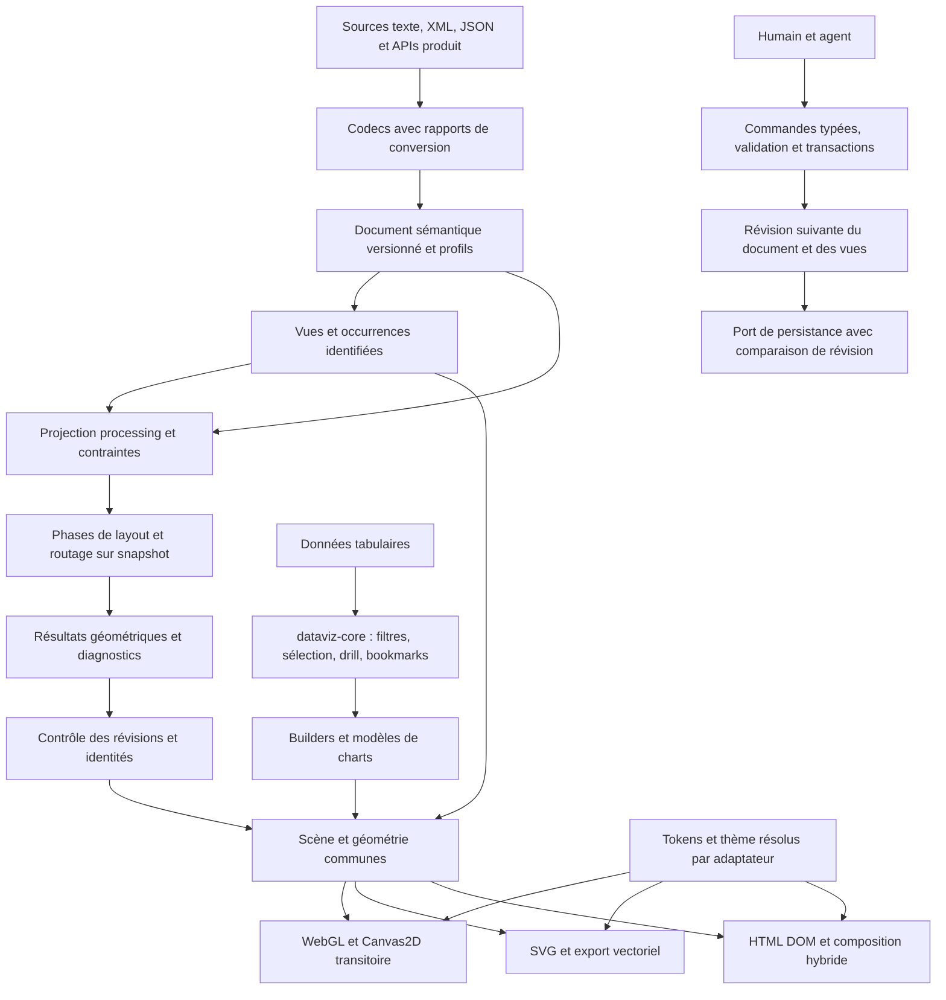
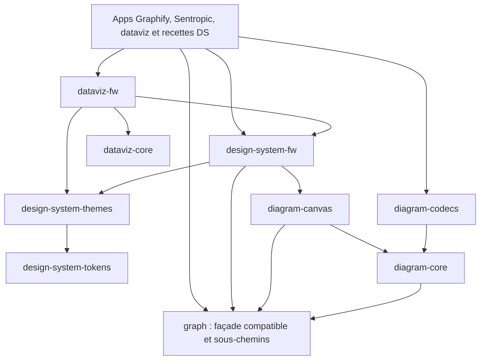

# Étude — Programme graphes, diagrammes et dataviz Sentropic

Date : 2026-09-15. Branche : `feat/graph-dataviz-repatriation`. État : **M0 livré comme étude ; programme ouvert**. Exécution : Astra ; conduite et restitution owner : session Claude `design-system`.

## 1. Autorité et périmètre

Le mandat owner du 2026-09-15 remplace l'ancienne orientation « graph reste dans Graphify ». Le dépôt DS devient la référence de `@sentropic/graph` et des cinq `@sentropic/dataviz-*`. Graphify reste propriétaire de son ingestion, indexation, connaissance, evidence et orchestration. Les applications dataviz peuvent rester dans leur dépôt comme consommateurs.

Les noms publiés, contrats existants, tests, licences et provenance sont conservés au rapatriement. Le déplacement précède les refactorings. ELK, Graphviz, diagram-js et JointJS sont des références de capacités : aucune nouvelle dépendance runtime ni copie de leur code n'est autorisée par cette étude. Les dépendances déjà présentes sont inventoriées, sans réécriture opportuniste.

Entrées reçues : mandat résumé en 11 sections et deux inventaires M0. Le texte complet de la conversation owner auquel le mandat fait référence n'est pas présent : **source-gap**, sans inventer de conditions supplémentaires. Les rapports présents sont autoportants ; `.astra-inputs/` reste hors livraison Git.

## 2. Base de preuves

| Source | Révision vérifiée | Rôle |
|---|---|---|
| DS, ce worktree | `422776869847079891a5be49a8e14313ea1c25a8` | exports, contrats, historique et streams |
| graphify | `8f19554cea3a4397fd66a90c7e9fd5ea54c81626` | package graph 0.2.0 et moteurs hors package |
| dataviz | `0869ae5b59bb308be7d43fbe0de58c5487e11f25` | les cinq packages 0.4.52 ; HEAD trois commits après tag |

Voir [correspondance exhaustive](../docs/graph-dataviz-source-map.md), [audit DS](../docs/graph-dataviz-ds-audit.md), [catalogue de couverture](../docs/graph-dataviz-reference-catalog.md), [plan](../plan/10-BRANCH_graph-dataviz-repatriation.md), [décisions](SPEC_DECISIONS_GRAPH_DATAVIZ_REPATRIATION.md). Le JSON des exports distingue API exposée, identité canonique et modules d'origine : les réexports core des quatre adaptateurs ne sont pas quatre implémentations.

WP20 : `done` historique avec acceptation `unknown` n'atteste pas l'adoption dataviz. Le DS a livré `scale`, tandis que le wrapper dataviz n'en transmet pas le contrat ; la grille dataviz implémente son propre éditeur ; nearest-X reste incomplet malgré crosshair/hide-on-leave. Les IDs historiques sont enrichis, pas remplacés. Détails et preuves exécutées dans l'audit DS.

## 3. Architecture cible — deux vues

### 3.1 Flux fonctionnel

Le flux montre une transaction jusqu'à la révision suivante ; à l'itération suivante cette révision devient l'entrée. Aucun résultat worker ne modifie directement le document. Les modèles de charts peuvent continuer à alimenter leurs composants DS actuels pendant la migration vers une scène commune.

### 3.2 Dépendances de packages proposées

Une flèche `A --> B` signifie **A importe B**. `fw` représente séparément Svelte, React, Vue et Angular ; aucun package d'un framework n'importe celui d'un autre framework.

Tous les labels de packages sont dans le scope `@sentropic`. `diagram-core`, `diagram-codecs`, `diagram-canvas` et les sous-chemins `graph` sont **proposés**, pas présents. Les arêtes Model→Graph ne visent que des contrats de projection/scène sans DOM ; un gate de dépendances interdit l'import de la façade renderer depuis ce noyau. `dataviz-core` demeure sans DS, graph, DOM, framework ni dépendance runtime. Le DAG machine et son contrôle sont dans `docs/graph-dataviz-architecture-dag.json`.

### 3.3 Responsabilités sans package par case

| Contenant | Modules/responsabilités | Règle de dépendance |
|---|---|---|
| `@sentropic/graph` conservé | contrats de buffers/positions ; géométrie ; registre/phases processing ; renderers et compatibilité | racine publique inchangée M1 ; sous-chemins sans DOM en M2 ; moteurs lourds isolés |
| `@sentropic/diagram-core` proposé | document/vues ; schémas/profils ; validation ; projection ; commandes et inverse logique | seulement contrats graph sans DOM ; ni renderer, ni app, ni framework |
| `@sentropic/diagram-codecs` proposé | codecs par format, source maps AST/CST, migrations et rapports | dépend du modèle ; chargement par codec, pas de XML/parser lourd au barrel central |
| `@sentropic/diagram-canvas` proposé | scènes diagrammes, SVG/HTML, composition, hit-testing, interaction et ports persistence/ressources | dépend des contrats modèle/graph ; n'importe pas les composants DS |
| `@sentropic/design-system-{fw}` existants | composants contrôlés, palette/inspecteur, styles et wrappers de canevas | tokens/thèmes + bibliothèques basses ; aucun import dataviz-fw/core requis |
| `@sentropic/dataviz-core` conservé | état inter-vues, transforms, modèles de charts, layout dashboards, annotations et sérialisation | indépendant ; ne devient pas un moteur DOM |
| `@sentropic/dataviz-{fw}` conservés | réactivité framework, liaison store→modèle→composants DS, exports utilisateurs | dépendance à sens unique vers core et DS ; PDF lazy conservé |
| Apps/recettes | assemblage de composants, ressources, accès/persistance produit, présence/live | consomment API publiques ; aucun import inverse depuis une bibliothèque |

Le découpage interne est une hypothèse réversible tant qu'aucun nouveau contrat public n'est publié. La séparation du document et la politique de publication ont leurs dossiers owner. Il n'y a pas de fusion automatique des calculs de couleurs avec les tokens : le core conserve ses fonctions, l'adaptateur injecte une palette résolue.

## 4. Modèle formel proposé

### 4.1 Cinq objets distincts

| Objet | Identités et contenu typé | Exclusions |
|---|---|---|
| `SemanticDocument` | documentId, schemaVersion, revision, profileRefs ; entités, relations, ports sémantiques, définitions de types, ressources référencées | positions/caméra, composants DOM, fonctions arbitraires |
| `ViewDocument` | viewId, semanticDocumentId, revision ; occurrences d'entités/relations/ports, groupes visuels, filtres de vue, état de présentation persistable | duplication d'entité pour chaque dessin ; état transient hover |
| `ProcessingSnapshot` | documentRevision + viewRevision + projectionVersion + inputHash ; nœuds/groupes/ports/contraintes normalisés et map inverse | mutation des objets d'origine ; types métier requis par un algorithme général |
| `Scene` / `GeometryFrame` | sceneRevision ; rects, contours, ports, paths, labels, z-order, transforms, hit regions ; références occurrence→entité | vérité du modèle métier ; stocker uniquement `x/y` en résultat riche |
| `TextSource` | sourceId, format/dialectVersion, contentHash, texte brut ; AST/CST propre au langage, source spans et correspondances IDs | AST universel ; promesse de conserver tout après régénération |

Le schéma minimal d'entité est une union discriminée par type et profil versionné. `EntityRef`, `OccurrenceRef`, `PortRef`, `ViewRef` et `ResourceRef` ne sont pas interchangeables. Une relation possède des extrémités typées avec rôle, direction et cardinalité ; une projection peut la transformer en nœud de jonction sans perdre son ID métier. Les attributs suivent un schéma de profil (quantité/unité, enum, référence, texte, date, booléen, collection bornée), pas un sac de propriétés non validé.

Une extension est nommée par URI de namespace, version de schéma et portée. Elle conserve son contenu source avec hash et son niveau de validation (`validated`, `preserved-unvalidated`, `unsupported`). Une extension conservée ne devient pas un fait métier validé. Aucune exécution de contenu importé, URL ou HTML n'est implicite.

### 4.2 Invariants

1. IDs stables, uniques dans leur namespace ; références résolues ou diagnostic explicite. Pas d'arête pendante supprimée silencieusement au niveau sémantique (le comportement historique `buildRenderGraphBuffers` reste conservé au niveau rendu).
2. Une même entité peut avoir plusieurs occurrences dans une vue et dans plusieurs vues. Déplacer/supprimer une occurrence n'efface pas l'entité. Supprimer l'entité exige une politique explicite pour toutes ses occurrences et relations.
3. Containment métier, hiérarchie de processing et groupement visuel sont distincts. Pas de cycle dans une hiérarchie déclarée arbre ; des relations métier cycliques restent légales selon leur profil.
4. Ports sémantiques et ports géométriques sont reliés par occurrence, avec côté/ordre/ancrage explicites. Une relation n'est pas réduite à deux numéros d'index sans ses extrémités d'origine.
5. Un schéma stocké n'est migré que par une fonction versionnée qui produit un rapport et conserve l'original. Une version majeure inconnue est refusée en écriture, conservée pour inspection/export si possible.
6. Une commande validée transforme `(document, vues, revision)` en `(nouvel état, effets, inverse ou raison non-inversible)`. Aucun succès partiel silencieux.
7. Une projection indique les éléments exclus et la raison, conserve une map origine→projection→résultat et ne déduit jamais la conformité métier d'une géométrie rendue.
8. Valeurs géométriques finies, unités explicites, un seul contrat monde→vue→pixels CSS→device pixels. Transforms parent-enfant composés identiquement pour rendu, sélection et export.

### 4.3 Profils natifs M3

| Profil | Types/relations minimaux proposés | Validation et limites |
|---|---|---|
| BPMN | process, participant/pool, lane, task/subprocess, start/intermediate/end event, gateway ; sequenceFlow, messageFlow, association ; condition/default et attachements | sequenceFlow contenu dans un process, messageFlow entre participants, nature/direction des événements et gateways, IDs/DI ; diagramme valide ≠ process exécutable ; moteurs d'exécution hors périmètre |
| ArchiMate | éléments par layer/aspect, junction/grouping, relations typées (composition/aggregation/assignment/realization/serving/access/influence/triggering/flow/association/specialization) ; vues et connexions | matrice relations/source/cible versionnée, direction et access mode, viewpoints ; pas de claim conformité complète sans fixture par contrainte |
| UML | classes/interfaces/packages, propriétés/opérations, association/généralisation/dépendance et multiplicité ; profils/stéréotypes | sous-ensemble déclaré ; UML ne se réduit pas au texte PlantUML ; diagrammes activité/séquence passent par profils spécifiques |
| Graphe générique | nœuds/relations/ports typés, hyperrelations projetables | aucun statut BPMN/UML induit par une forme visuelle |

Ces profils partagent les infrastructures de références, commandes et vues ; leurs règles métier restent identifiables. Versions exactes et fixtures de qualification à fixer dans le dossier D3.

## 5. Pivots et fidélité

| Pivot | Entrée/sortie et propriété conservée | Qualification nécessaire |
|---|---|---|
| UML / PlantUML | modèle UML sous-ensemble ↔ AST PlantUML par famille ; texte original + spans | classes/relations/profils d'abord selon fixtures ; directives non modélisées en extension, disposition du moteur non garantie |
| Mermaid | grammaire/version + famille (flowchart, sequence, class, state, ER, etc.) ; AST/CST spécifique | une matrice par famille ; pas de traitement de toutes les familles comme simples nodes/edges |
| BPMN | modèle natif ↔ BPMN XML + BPMNDI/DC/DI ; IDs, refs, bounds, waypoints, extensions | version/namespaces, diagrammes multiples, ports/labels ; extensions fournisseur conservées et signalées |
| ArchiMate | modèle natif ↔ Open Group Model Exchange XML | namespaces/version, éléments/relations/vues/style, références et propriétés ; matrice de validation séparée du rendu |
| draw.io | pages mxfile / mxGraphModel, cellules/parents/geometry/styles ; compression détectée | distinction cellule de vue et entité, géométries relatives, connecteurs, pages ; styles inconnus préservés, images via ResourcePort |
| Sparx Enterprise Architect | variantes XMI + profils/version EA identifiés, IDs/refs, extensions vendeur | aucun « format EA universel » ; fixture de chaque dialecte ; XMI sémantique et layout exporté ne sont pas interchangeables |
| Rendu SVG / DOM / WebGL | scène→SVG vectoriel, DOM interactif et buffers typés ; identité de sélection | les pixels/buffers ne permettent pas de reconstruire tout le document ; export HTML réduit/annoté si non vectorisable |

Chaque conversion retourne `ConversionReport { sourceFormat, sourceVersion, targetFormat, targetVersion, inputHash, mapping, entries[] }`. Chaque entrée référence un élément/champ et l'un des statuts demandés : `converted`, `preserved-extension`, `degraded`, `ignored`, `unsupported`, avec raison, sévérité et localisation. Le récapitulatif compte les statuts ; un export échoue si une perte déclarée bloquante par sa politique est détectée. « ignored » exige une règle explicite, jamais un trou de couverture.

Conserver le source brut permet un retour octet-identique **uniquement sans transformation** ; après modification, le contrat porte sur le sous-ensemble sémantique testé et un rapport de pertes. Pas de promesse d'aller-retour universel sans perte. Une source textuelle modifiée et un modèle modifié depuis la même révision provoquent un conflit explicite ; aucune autorité « dernier arrivé » implicite.

## 6. Processing et workers

Le registre décrit capacités d'entrée/sortie, contraintes acceptées, précision, déterminisme/seed, annulation, support incrémental, environnement (main thread/worker/server), coût mesuré et diagnostics. Il enregistre séparément **algorithmes**, **groupes d'options**, **options et domaines de valeurs**, **phases** et **profils métier**.

Phases composables : normalisation/validation → composantes et hiérarchie → détection/résolution des cycles pour projection → ranking/layering → minimisation croisements → placement/compaction → ports → routage → labels → packing/dé-chevauchement → validation. Un profil métier émet des contraintes ; il ne recopie pas tout le pipeline. Layered/Sugiyama, arbres, radial, force/stress, grilles et packing sont des capacités distinctes. Routes orthogonales, octilinéaires et courbes annoncent obstacles, ports, self-loops, labels et métriques réellement supportés.

État source : `force` du registre graph est un passthrough. Barnes-Hut FA2 déterministe est dans `graphify/src/graph-layout.ts` ; hierarchy-aware dans `src/hierarchy-layout.ts` ; le worker studio utilise un alias Vite vers ce code. Les mathématiques de git-flow sont rapatriables, leurs producteurs agent-stats restent produit. `dataviz-core/forceGraph.ts` est un builder de données sans simulation. `metro` ne prouve pas un routage octilinéaire complet. Voir le catalogue détaillé pour le reste.

`LayoutResult` contient bounds/rects, positions et shapes, ports, routes avec segments/control points, labels placés, identities, inputRevision, seed, métriques et diagnostics. Un adaptateur en extrait `PositionFrame` pour l'API historique ; il ne masque pas l'absence de routes dans une ancienne stratégie.

Protocole worker proposé : `requestId`, `documentRevision`, `viewRevision`, `inputHash`, `algorithmId/version`, `seed`, contraintes et buffers possédés/clonés. Réponse mêmes identifiants + résultat ou erreur structurée. Un buffer transféré n'est plus utilisé par l'émetteur ; snapshot immutable ou copie explicite. Le coordinateur accepte seulement une réponse correspondant aux révisions encore courantes et à la requête active. Annuler est coopératif ; le rejet des réponses périmées est obligatoire même si le calcul ne peut être interrompu. Les éléments verrouillés/pinnés restent stables ; une contrainte impossible produit un diagnostic avec références, pas des coordonnées invalides.

## 7. Rendu, sélection et canevas

La scène porte des chemins géométriques et hit regions indépendants du backend. `@sentropic/graph` conserve son renderer comme couche de dessin. La sélection géométrique (point/région/lasso/intersection) est mutualisée ; le backend de dessin n'est pas propriétaire de la sélection. Labels, largeurs de traits, devicePixelRatio, clipping, z-order et transformations ont un contrat commun.

SVG couvre vecteurs/exports ; WebGL couvre les gros graphes ; Canvas2D reste le chemin de compatibilité dont les golden hérités sont à rejouer au rapatriement. HTML peut être un backend DOM pour les nœuds ou une couche interactive au-dessus de SVG/WebGL. Dans ce cas les arêtes sont dessinées par le backend vectoriel/GL, alignées sur les bounds DOM mesurés ; resize/font loading déclenche une invalidation géométrique versionnée. Le DOM garde focus/IME/accessibilité ; une représentation accessible permet navigation/inspection des scènes WebGL. Une capture ne prouve ni fidélité des textes ni a11y.

Les interactions couvrent sélection, déplacement, redimensionnement, connexion de ports, snap/grille/guides, groupes, copier-coller, palette, inspecteur, undo/redo et annotations/cerclage. Les primitives DS et tokens servent les contrôles. `DiagramAnnotator` est aujourd'hui une recette Canvas2D de capture d'image avec ellipses/rectangles et export PNG dans l'app docs ; ses dépendances SvelteKit et son état local ne doivent pas entrer dans le noyau.

Humains et agents soumettent les mêmes commandes discriminées : `CreateEntity`, `SetTypedAttribute`, `ConnectRelation`, `CreateOccurrence`, `MoveOccurrences`, `ResizeOccurrences`, `SetRoute`, `RemoveOccurrence`, `DeleteEntity`, `UpdateView`, `AddAnnotation`. Chaque commande précise IDs, portée, baseRevision, commandId/idempotence, auteur effectif et cible. Validation métier identique pour tous ; le contrôle d'accès vient d'un port hôte.

Trois étapes : aperçu éphémère → transaction validée atomicité/inverse → persistance via `compareAndSwap(baseRevision, nextState)`. Une commande invalide ou périmée laisse le modèle intact ; undo est une nouvelle transaction contre l'état actuel, pas une réécriture du journal. Les conflits non commutatifs sont présentés avec les cibles affectées, sans inventer une fusion universelle.

Ports proposés : `DocumentRepository`, `ResourceResolver`, `CommandAuthorizer`, `ActivityPublisher`, `PresenceProvider`. Leur implémentation peut être mémoire/fichier/HTTP/Sentropic. Évidence Sentropic ciblée : `api/src/services/catalog/types.ts` et `sources/canvas-template-source.ts` décrivent des starters LiveDocument, **pas un store/CRDT/editor runtime**. Leur carve-out ne démontre pas une intégration live existante. Les présences/scopes h2a et les items track ne sont pas des verrous. Audit élargi sous `GD-M6-SENTROPIC` avant binding aux contrats réels.

## 8. Apps et preuves

Catalogue JointJS comme plancher de couverture dans le rapport dédié : chaque recette doit mapper modèle, codec, processing, moteur, interaction, état dataviz et contrat métier. Chaque application possède une fixture d'entrée, un scénario humain, le même scénario via commandes agent, exports et mesure de performance. Une démonstration rendue ne signifie pas conformité BPMN/ArchiMate/UML ni couverture du produit de référence.

Gates transverses : indépendance des noyaux et absence de cycles ; packaging/SSR/peers/CSS ; invariants/références/migrations ; rapports de conversion ; contraintes impossibles/incrémental/seed ; géométrie multi-backend ; clavier/focus/IME/a11y/thèmes ; transactions/undo/conflits/rejet worker ; filtres/drill/bookmarks/export dataviz ; mesures de performance reproductibles ; adoption par imports publics de versions publiées.

## 9. Hypothèses réversibles et statut

- M1 conserve versions et comportement source ; aucun package n'est publié à la place de la version existante. Les versions de prochaine release seront décidées avant publication.
- Le premier sous-lot réalisable est graph + dataviz-core, indépendants des écarts `GeoMap`/`GeoChart` et de la parité Angular. Les quatre adaptateurs restent intégralement dans M1, avec gates séparés.
- Le design futur reste au stade STUDY tant que les challenges fable 5.1 et gemini 3.7 prescrits par l'owner ne sont pas réconciliés. Cela n'empêche pas le rapatriement conservatoire explicitement mandaté.
- Les critères ajoutés aux anciens items WP20/S7 ne réécrivent pas leur histoire. La projection `--require-accepted` et le checkpoint exposent le travail restant ; aucun motif de réouverture non prouvé n'est inventé.
- Aucune portée d'application de cette étude n'autorise une publication npm, une suppression des implémentations source, une modification du checkout du conducteur ou une décision owner par procuration.
